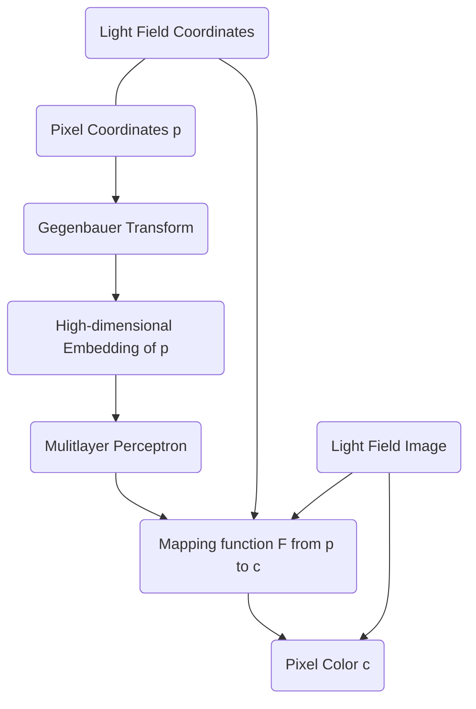

# SIGNET: Efficient Neural Representation for Light Fields

## Introduction

## Overview

### Light Fields as Functions

### Function Approximations

一张图片 $\mathcal F(x,y)$ 可以表示为 $N$ 个正交基函数的权重和：
$$
\tilde{\mathcal F}(x,y)=\sum_{i=1}^{N}a_i\Theta_i(x,y)
$$
假设基函数已知，则函数就可以用一组系数向量 $\{a_i|i\in\{1,\dots,N\}\}$ 表示，这就是一种图像压缩算法。

对于 4D 光场函数 $\mathcal{F}(x,y,u,v)$ 也可以用同样的压缩方法，不过，我们用 $L$ 层的 MLP 来学习基函数的系数。

### MLP for Approximation

用 MLP 可以学习 Fourier 展开的系数，但是随着维度和展开项增加，输出的系数也会指数级的增加。

### Towards Multidimensional Input

SIREN 用 $\sin$ 函数做两个层的激活函数，FourierMLP 先把输入用做了 Fourier 变换。但是他们的本质是一样的。特别是 NeRF 和 FourierMLP 里面，每个维度都是做的独立的变换，即用 $\{\cos(nx)\},\{\cos(my)\}$ 一共 $1\times2(N+M)$ 个输入来代替 $\{\cos(nx+my)\}$ 一共 $1\times4NM$ 个输入。

### Gegenbauer Basis

Gegenbauer 方程：
$$
(1-x^2)\frac{d^2y}{dx^2}-2(2\lambda+1)x\frac{dy}{dx}+n(n+\lambda)y=0
$$
方程的解为 Gegenbauer 多项式，记为 $C_{n}^{\lambda}(x)$，满足：
$$
C_{0}^{(\lambda)}(x)=1,C_{1}^{(\lambda)}(x)=2\lambda x\\
C_{n}^{(\lambda)}(x)=\frac{1}{n}\left[2x(n+\lambda-1)C_{n-1}^{(\lambda)}(x)-(n+2\lambda-2)C_{n-2}^{(\lambda)}(x)\right]
$$
Gegenbauer 多项式具有生成函数：
$$
(1-2xt+t^2)^{-\lambda}=\sum_{n=0}^{\infty}C_{n}^{(\lambda)}(x)t^n\\
\lambda>0, t\in(-1,1),x\in[-1,1]
$$
取 $\lambda=1/2$ 就是 Legendre 函数。

## Methods

### Proposed Framework

输入的坐标 $\mathbf p=[u,v,x,y]$ 用一组函数变换，本质上是一种 **Positional Encoding**。
$$
\mathcal E(\mathbf p)=\\
[\mathcal S_{1}(u),\dots,\mathcal S_{C_{u}}(u),\\
\mathcal S_{1}(v),\dots,\mathcal S_{C_{v}}(v),\\
\mathcal S_{1}(x),\dots,\mathcal S_{C_{x}}(x),\\
\mathcal S_{1}(y),\dots,\mathcal S_{C_{y}}(y)]
$$
其中 $C_u,C_v,C_x,C_y$ 是各个轴方向的基函数的最大阶数。这里 $S_n(x)$ 选择为 Gegenbauer 多项式。

## Results

### Extension to Light Field Videos

因此，我们将光场视频分成更小的块，这样每个块都由一个小的 SIGNET 独立学习。
Therefore, we divide a light field video into smaller blocks such that each block is independently learned by a small SIGNET.

