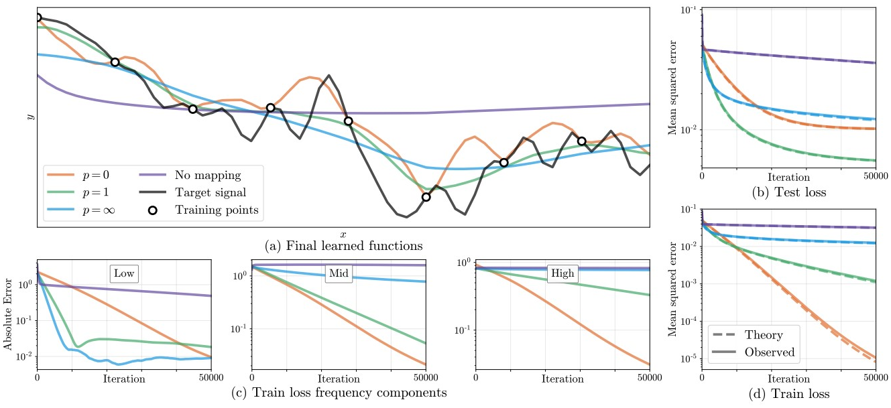

# Fourier Features Let Networks Learn High Frequency Functions in Low Dimension Domains

> 一般的机器学习任务是学习一个从较高维度到较低维度的映射，而且对于数据点的拟合可能没有非常精确。NeRF 是学习一个从较低维度到较高维度的映射，而且数据点在所在空间中十分密集。一旦对于数据点的拟合有一些不精确，就会导致图像变糊。这里的解决方案是，把低维数据映射到高维空间中，即嵌入。个人认为，比较好的映射应该把两个点区分的比较开，且映射是连续的。

## 0 Abstract

我们表明，通过简单的傅立叶特征映射传递输入点使多层感知器 (MLP) 能够学习低维问题域中的高频函数。
We show that passing input points through a simple Fourier feature mapping enables a multilayer perceptron (MLP) to learn high-frequency functions in low dimensional problem domains.

## 1 Introduction

MLP 难以学习高频函数，这种现象在文献中被称为“频谱偏差”。
MLPs have difficulty learning high frequency functions, a phenomenon referred to in the literature as "spectral bias".

NTK 理论表明，这是因为标准的基于坐标的 MLP 对应于具有快速频率衰减的内核，这有效地阻止了它们能够表示自然图像和场景中存在的高频内容。
NTK theory suggests that this is because standard coordinate-based MLPs correspond to kernels with a rapid frequency falloff, which effectively prevents them from being able to represent the high-frequency content present in natural images and scenes.

Fourier features mapping:
$$
\gamma(\mathbf{v})=[a_1\sin(2\pi\mathbf{b}_1^T\mathbf{v}),a_1\cos(2\pi\mathbf{b}_1^T\mathbf{v}),\dots,a_m\sin(2\pi\mathbf{b}_m^T\mathbf{v}),a_m\cos(2\pi\mathbf{b}_m^T\mathbf{v})]
$$

> For NeRF's positional encoding:
> $$
> a_i=1,b_{3i+k}=(2^i\delta_{0k},2^i\delta_{1k},2^i\delta_{2k})^T
> $$

我们展示了这种映射将 NTK 转换为一个平稳（平移不变）的内核，并通过修改频率向量 $\mathbf{b}_j$ 来调整 NTK 的频谱，从而控制相应 MLP 可学习的频率范围。
We show that this mapping transforms the NTK into a stationary (shift-invariant) kernel and enables tuning the NTK's spectrum by modifying the frequency vectors $\mathbf{b}_j$, thereby controlling the range of frequencies that can be learned by the corresponding MLP.

我们表明，设置 $a_j = 1$ 并从各向同性分布中随机抽样 $\mathbf{b}_j$ 的简单策略可以获得良好的性能，并且该分布的尺度（标准差）比其特定形状更重要.
We show that the simple strategy of setting $a_j = 1$ and randomly sampling $\mathbf{b}_j$ from an isotropic distribution achieves good performance, and that the scale (standard deviation) of this distribution matters much more than its specific shape.

我们利用 NTK 理论和简单的实验表明，傅里叶特征映射可用于克服基于坐标的 MLP 对低频的频谱偏差，方法是允许它们学习更高的频率。
We leverage NTK theory and simple experiments to show that a Fourier feature mapping can be used to overcome the spectral bias of coordinate-based MLPs towards low frequencies by allowing them to learn much higher frequencies.

我们证明，具有适当选择尺度的随机傅里叶特征映射可以极大地提高基于坐标的 MLP 在计算机视觉和图形领域许多低维任务中的性能。
We demonstrate that a random Fourier feature mapping with an appropriately chosen scale can dramatically improve the performance of coordinate-based MLPs across many low-dimensional tasks in computer vision and graphics.

## 2 Related Work

使用随机傅里叶特征（RFF）以正弦波输入映射来近似静止核，并提出调整映射参数的技术。我们的工作通过直接将这种映射解释为对所产生的网络的 NTK 的改版而加以扩展。此外，我们还解决了多维坐标的嵌入问题，这对于视觉和图形任务是必要的。
Using random Fourier features (RFF) to approximate stationary kernels with a sinusoidal input mapping and propose techniques to tune the mapping parameters. Our work extends this by directly explaining such mappings as a modification of the resulting network’s NTK. Additionally, we address the embedding of multidimensional coordinates, which is necessary for vision and graphics tasks.

在整个梯度下降过程中，网络的输出仍然接近于线性动力系统的输出，其收敛速度受 NTK 矩阵的特征值制约。
The outputs of a network throughout gradient descent remain close to those of a linear dynamical system whose convergence rate is governed by the eigenvalues of the NTK matrix.

## 3 Background and Notation

### Kernel regression

Kernel regression is a classic nonlinear regression algorithm.

|                         Symbols                          |                         Descriptions                         |
| :------------------------------------------------------: | :----------------------------------------------------------: |
| $(\mathbf{X},\mathbf{y})=\{(\mathbf{x_i},y_i)\}_{i=1}^n$ |                     features and labels                      |
|                       $\mathbf{K}$                       | $\mathbf{K}_{ij}=k(\mathbf{x}_i,\mathbf{x}_j)$ where $k$ is a symmetric positive semi-definite kernel function which represents the "similarity" |
|                        $\hat{f}$                         |                         an estimate                          |

$$
\hat{f}(\mathbf{x})=\sum_{i=1}^n(\mathbf{K}^{-1}\mathbf{y})_ik(\mathbf{x}_i,\mathbf{x})
$$
观地说，在任何点 $\mathbf{x}$ 的核回归估计可以被认为是使用相应 $\mathbf{x}_i$ 和 $\mathbf{x}$ 之间的相似性对训练标签 $y_i$ 的加权和。
Intuitively, the kernel regression estimate at any point $\mathbf{x}$ can be thought of as a weighted sum of training labels $y_i$ using the similarity between the corresponding $\mathbf{x}_i$ and $\mathbf{x}$.

### Approximating deep networks with kernel regression

|                           Symbols                            |                         Descriptions                         |
| :----------------------------------------------------------: | :----------------------------------------------------------: |
|                             $f$                              | a fully-connected deep network with weights $\theta$ initialized from a Gaussian distribution $\mathcal{N}$ |
| $\hat{\mathbf{y}}^{(t)}=f(\mathbf{X}_{\mathrm{test}};\theta)$ | the network's predictions on input points $\mathbf{X}_{\mathrm{test}}$ at training iteration $t$ |
|                 $\mathbf{K}_{\mathrm{test}}$                 | the NTK matrix between all points in $\mathbf{X}_{\mathrm{test}}$ and all points in the training dataset |

当 $f$ 里面层的宽度趋于无穷大并且 SGD 的学习率趋于零时，函数 $f(\mathbf{x};\theta)$ 在训练过程中使用神经正切核 (NTK) 收敛到核回归解决方案，NTK 定义为：
When the width of the layers in $f$ tends to infinity and the learning rate for SGD tends to zero, the function $f(\mathbf{x};\theta)$ converges over the course of training to the kernel regression solution using the neural tangent kernel (NTK), defined as:
$$
k_{\mathrm{NTK}}(\mathbf{x}_i,\mathbf{x}_j)=\mathbb{E}_{\theta\sim\mathcal{N}}\left\langle\frac{\partial{f}(\mathbf{x}_i;\theta)}{\partial\theta},\frac{\partial{f}(\mathbf{x}_j;\theta)}{\partial\theta}\right\rangle
$$
当输入限制为超球面时，MLP 的 NTK 可以写成点积核（形式为 $h_{\mathrm{NTK}}(x^T_i, x_j)$ 的核，$h_{\mathrm{NTK}}:\mathbb{R}\mapsto\mathbb{R}$ 为标量函数）。
When the inputs are restricted to a hypersphere, the NTK for an MLP can be written as a dot product kernel (a kernel in the form $h_{\mathrm{NTK}}(x^T_i, x_j)$ for a scalar function $h_{\mathrm{NTK}}:\mathbb{R}\mapsto\mathbb{R}$).  

我们考虑一个用 L2 损失和学习率训练的网络，其中网络的权重被初始化，使得网络在初始化时的输出接近于零。
We consider a network trained with an L2 loss and a learning rate, where the network’s weights are initialized such that the output of the network at initialization is close to zero.

任何数据 $\mathbf{X}_{\mathrm{test}}$ 在 $t$ 次训练迭代后的网络输出可以近似为：
The network’s output for any data $\mathbf{X}_{\mathrm{test}}$ after $t$ training iterations can be approximated as:
$$
\hat{\mathbf{y}}^{(t)}\approx\mathbf{K}_{\mathrm{test}}\mathbf{K}^{-1}(\mathbf{I}-\exp(-\eta\mathbf{K}t))\mathbf{y}
$$

### Spectral bias when training neural networks

|                  Symbols                  |                         Descriptions                         |
| :---------------------------------------: | :----------------------------------------------------------: |
| $\hat{\mathbf{y}}^{(t)}_{\mathrm{train}}$ | the network’s predictions on the training dataset at iteration $t$ |
|           $\mathbf{Q},\Lambda$            | $\mathbf{K}=\mathbf{Q}\Lambda\mathbf{Q}^T$, eigen decomposition, $\mathbf{Q}$ orthogonal, $\Lambda$ diagonal matrix whose entries are the eigenvalues $\lambda_i\ge0$ |

$$
\exp(-\eta\mathbf{K}t)=\mathbf{Q}\exp(-\eta\Lambda t)\mathbf{Q}^T
$$

then:
$$
\begin{align*}
\mathbf{Q}^T(\hat{\mathbf{y}}^{(t)}_{\mathrm{train}}-\mathbf{y})&\approx\mathbf{Q}^T([\mathbf{I}-\exp(-\eta\mathbf{K}t)]\mathbf{y}-\mathbf{y})\\
&=-\mathbf{Q}^T\exp(-\eta\mathbf{K}t)\mathbf{y}\\
&=-\exp(-\eta\Lambda t)\mathbf{Q}^T\mathbf{y}
\end{align*}
$$
这意味着如果我们在 NTK 的特征基中考虑训练收敛，则绝对误差 $|\mathbf{Q}^T(\hat{\mathbf{y}}^{(t) }_{\mathrm{train}}-\mathbf{y})|$ 将以 $\eta\lambda_i$ 的速率近似呈指数衰减。
This means that if we consider training convergence in the eigenbasis of the NTK, the $i$-th component of the absolute error $|\mathbf{Q}^T(\hat{\mathbf{y}}^{(t)}_{\mathrm{train}}-\mathbf{y})|$ will decay approximately exponentially at the rate $\eta\lambda_i$.

换句话说，目标函数中对应于具有较大特征值的核特征向量的分量将被更快地学习。对于传统的 MLP，NTK 的特征值衰减很快。
In other words, components of the target function that correspond to kernel eigenvectors with larger eigenvalues will be learned faster. For a conventional MLP, the eigenvalues of the NTK decay rapidly.

## 4 Fourier Features for a Tunable Stationary Neural Tangent Kernel

机器学习分析通常解决输入是高维点（例如，将图像的像素重新整形为向量）并且训练示例分布稀疏的情况。相比之下，在这项工作中，我们考虑低维回归任务，其中假设输入是 $\mathbb R^d$ 子集中的密集坐标，用于小 $d$ 值（例如像素坐标）。从内核回归的角度查看深度网络时，此设置有两个重要含义：
Machine learning analysis typically addresses the case in which inputs are high dimensional points (e.g. the pixels of an image reshaped into a vector) and training examples are sparsely distributed. In contrast, in this work we consider low-dimensional regression tasks, wherein inputs are assumed to be dense coordinates in a subset of $\mathbb R^d$ for small values of $d$ (e.g. pixel coordinates). This setting has two significant implications when viewing deep networks through the lens of kernel regression:  

1. 因为训练点以密度均匀分布，我们希望组合的 NTK 在输入域上是移位不变的。在输入被归一化到超球面的问题中（在机器学习中很常见），点积核（例如常规 NTK）对应于球面卷积。然而，我们设定中的输入在欧几里得空间中是密集的。输入坐标的傅立叶特征映射使组合的 NTK 静止（移位不变），充当输入域上的卷积核。
    We would like the composed NTK to be shift-invariant over the input domain, since the training points are distributed with uniform density. In problems where the inputs are normalized to the surface of a hypersphere (common in machine learning), a dot product kernel (such as the regular NTK) corresponds to spherical convolution. However, inputs in our setting are dense in Euclidean space. A Fourier feature mapping of input coordinates makes the composed NTK stationary (shift-invariant), acting as a convolution kernel over the input domain.
2. 我们希望控制 NTK 的带宽，以提高训练速度和泛化能力。一个频谱衰减较慢的“宽”核可以使得高频成分的快速训练收敛。然而，我们从信号处理中知道，使用频谱太宽的内核重建信号会导致高频混叠伪影。 
    We would like to control the bandwidth of the NTK to improve training speed and generalization. A "wider" kernel with a slower spectral falloff achieves faster training convergence for high frequency components. However, we know from signal processing that reconstructing a signal using a kernel whose spectrum is too wide causes high frequency aliasing artifacts.   

### Fourier features and the composed neural tangent kernel

$$
\gamma(\mathbf{v})=[a_1\sin(2\pi\mathbf{b}_1^T\mathbf{v}),a_1\cos(2\pi\mathbf{b}_1^T\mathbf{v}),\dots,a_m\sin(2\pi\mathbf{b}_m^T\mathbf{v}),a_m\cos(2\pi\mathbf{b}_m^T\mathbf{v})]
$$

由于 $\cos(a-b)=\cos(a)\cos(b)+\sin(a)\sin(b)$：
$$
\begin{align*}
k_{\gamma}(\mathbf{v}_1,\mathbf{v}_2)&=\gamma(\mathbf{v}_1)^T\gamma(\mathbf{v}_2)\\
&=\sum_{j=1}^{m}a_j^2\cos(2\pi\mathbf{b}_1^T(\mathbf{v}_1-\mathbf{v}_2))\\
&\triangleq h_{\gamma}(\mathbf{v}_1-\mathbf{v}_2)
\end{align*}
$$
请注意，这个内核是静止的（仅是各点之间差的函数）。
Note that this kernel is stationary (a function of only the difference between points).

我们可以将映射视为核函数的傅立叶近似：$\mathbf{b}_j$ 是用于近似核的傅立叶基频，$a^2_j$ 是对应的傅立叶级数系数。
We can think of the mapping as a Fourier approximation of a kernel function: $\mathbf{b}_j$ are the Fourier basis frequencies used to approximate the kernel, and $a^2_j$ are the corresponding Fourier series coefficients.

之后就是送入 MLP，就等价于 SVM 的核回归：
$$
h_{\mathrm{NTK}}(\gamma(\mathbf{v}_1)^T\gamma(\mathbf{v}_2))=h_{\mathrm{NTK}}(h_{\gamma}(\mathbf{v}_1-\mathbf{v}_2))
$$
MLP 函数在每个输入训练点 $\mathbf{v}_i$ 处近似为组合 NTK 与加权 delta 函数的卷积：
The MLP function approximates a convolution of the composed NTK with a weighted Dirac delta at each input training point $\mathbf{v}_i$:
$$
\hat{f}=(h_{\mathrm{NTK}}\circ h_{\gamma})*\sum_{i=1}^nw_i\delta_{\mathbf{v}_i}
$$
where $\mathbf{w}=\mathbf{K}^{-1}\mathbf{y}$.

## 5 Manipulating the Fourier Feature Mapping

### Visualizing the composed NTK

更高的频率映射（更高的傅立叶系数）会导致组合核具有更宽的频谱，从而可以更快地收敛高频分量。
Higher frequency mappings (higher Fourier coefficient) result in composed kernels with wider spectra, which enables faster convergence for high-frequency components.

We set $b_j=j$ (full Fourier basis in 1D) and $a_j=1/j^p$ for $j=\{1,\dots,n/2\}$. We use $p=\infty$ to denote the mapping $\gamma(v)=[\cos2\pi v,\sin2\pi v]^T$ that simply wraps $[0,1)$ around the unic circle (this is referred to as the "basic" mapping in later experi)

### Effects of Fourier features on network convergence

我们通过从具有参数 $\alpha$ 的族中采样 $cn$ 个值来生成一维函数的 gt，如下所示：我们独立同分布地采样长度为 $cn$ 的标准高斯向量，将其第 i 个条目缩放 $1/i^{\alpha}$，然后返回其傅里叶逆变换的实部。我们将其称为 “$1/f^{\alpha}$ 噪声” 信号。
We generate ground truth 1D functions by sampling $cn$ values from a family with parameter $\alpha$ as follows: we sample a standard i.i.d. Gaussian vector of length $cn$, scale its i-th entry by $1/i^{\alpha}$, then return the real component of its inverse Fourier transform. We will refer to this as a "$1/f^{\alpha}$ noise" signal.

