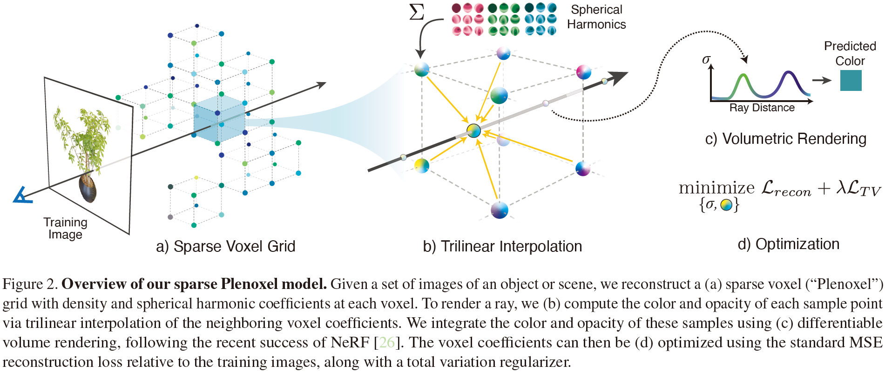

# Plenoxels: Radiance Fields without Neural Networks

## 0 Abstract

Plenoxels 将场景表示为具有球谐函数的稀疏 3D 网格。这种表示可以通过梯度方法和正则化从标定图像中优化，而无需任何神经网络。
Plenoxels represent a scene as a sparse 3D grid with spherical harmonics. This representation can be optimized from calibrated images via gradient methods and regularization without any neural components.

## 1 Introduction

我们提供了一个自定义 CUDA 实现，它利用模型的简单性来实现显着的加速。
We provide a custom CUDA implementation that capitalizes on the model simplicity to achieve substantial speedups.

尽管我们的实现并未针对快速渲染进行优化，但我们可以以 15 fps 的交互速率渲染新视角。如果需要更快的渲染，我们优化的 Plenoxel 模型可以转换为 PlenOctree。
Although our implementation is not optimized for fast rendering, we can render novel viewpoints at interactive rates 15 fps. If faster rendering is desired, our optimized Plenoxel model can be converted into a PlenOctree.

我们将我们的模型称为 Plenoxel 用于全光体积元素，因为它由稀疏体素网格组成，其中每个体素存储不透明度和球谐系数。这些系数被插值以在空间中连续模拟全光函数。
We call our model Plenoxel for plenoptic volume elements, as it consists of a sparse voxel grid in which each voxel stores opacity and spherical harmonic coefficients. These coefficients are interpolated to model the full plenoptic function continuously in space.

尽管我们的核心模型是有界体素网格，但我们可以通过使用 NDC（用于前向场景）或通过用多球图像围绕我们的网格来编码背景（用于 360 度场景）来建模无界场景。
Although our core model is a bounded voxel grid, we can model unbounded scenes by using normalized device coordinates (for forward-facing scenes) or by surrounding our grid with multisphere images to encode the background (for 360 scenes).

我们的方法表明，可以使用来自逆问题的标准工具来实现逼真的体积重建：数据表示、正向模型、正则化函数和优化器。我们的方法表明，这些组件中的每一个都可以很简单，并且仍然可以实现最先进的结果。
Our method reveals that photorealistic volumetric reconstruction can be approached using standard tools from inverse problems: a data representation, a forward model, a regularization function, and an optimizer. Our method shows that each of these components can be simple and state of the art results can still be achieved.

## 2 Related Work

### Classical Volume Reconstruction

### Neural Volume Reconstruction

### Accelerating NeRF

## 3 Methods

### 3.1 Volume Rendering

虽然这个公式并不精确（它假设样本之间的单一散射和恒定值），但它是可微的，并且能够根据每个训练射线的误差更新 3D 模型。
Although this formula is not exact (it assumes single scattering and constant values between samples), it is differentiable and enables updating the 3D model based on the error of each training ray.

### 3.2 Voxel Grid with Spherical Harmonics

然而，为了简单和易于实现三线性插值，我们不使用八叉树作为我们的数据结构。相反，我们将带有指针的密集 3D 索引数组存储到一个单独的数据数组中，该数组仅包含占用体素的值。
However, for simplicity and ease of implementing trilinear interpolation, we do not use an octree for our data structure. Instead, we store a dense 3D index array with pointers into a separate data array containing values for occupied voxels only.

我们使用 2 次球谐函数，每个颜色通道需要 9 个系数，每个体素总共需要 27 个谐波系数。因为 PlenOctrees 发现高次球谐函数收益比较小。
We use spherical harmonics of degree 2, which requires 9 coefficients per color channel for a total of 27 harmonic coefficients per voxel. We use degree 2 harmonics because PlenOctrees found that higher order harmonics confer only minimal benefit.

我们的 Plenoxel 网格使用三线性插值来定义整个体积的连续全光函数。这与 PlenOctrees 不同，后者假设不透明度和球谐系数在每个体素内保持不变。
Our Plenoxel grid uses trilinear interpolation to define a continuous plenoptic function throughout the volume. This is in contrast to PlenOctrees, which assumes that the opacity and spherical harmonic coefficients remain constant inside each voxel.

### 3.3 Interpolation

