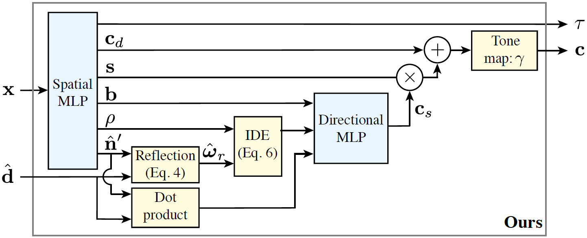

# Ref-NeRF: Structured View-Dependent Appearance for Neural Radiance Fields

## 0 Abstract

Ref-NeRF 用反射辐射的表示代替了 NeRF 的与视角相关的出射辐射的参数化，并使用一组随空间变化的场景属性来构造该函数。
Ref-NeRF replaces NeRF’s parameterization of view-dependent outgoing radiance with a representation of reflected radiance and structures this function using a collection of spatially-varying scene properties.

## 1 Introduction

尽管 NeRF 的视角相关外观渲染乍一看似乎是合理的，但仔细检查镜面高光会发现虚假的光泽伪影在渲染视角之间淡入淡出，而不是以物理上合理的方式在表面上平滑移动。
Although NeRF’s renderings of view-dependent appearance may appear reasonable at first glance, a close inspection of specular highlights reveals spurious glossy artifacts that fade in and out between rendered views, rather than smoothly moving across surfaces in a physically-plausible manner.

首先，NeRF 将每个点的出射辐射率参数化为视角方向的函数，不适合插值。即使对于一个简单设置，场景的真实辐射度函数也会随着视角方向快速变化，尤其是在镜面高光附近。
First, NeRF’s parameterization of the outgoing radiance at each point as a function of the viewing direction is poorly-suited for interpolation. Even for a simple toy setup, the scene’s true radiance function varies quickly with view direction, especially around specular highlights.

其次，NeRF 倾向于使用物体内部的各向同性发射器来“伪造”镜面反射，而不是表面点发射的与视角相关的辐射，从而导致物体具有半透明或“有雾”的外壳。
Second, NeRF tends to “fake” specular reflections using isotropic emitters inside the object instead of view-dependent radiance emitted by points at the surface, resulting in objects with semitransparent or “foggy” shells.

Ref-NeRF 通过提供视角向量关于局部法线向量的反射，而不是视角向量本身来重新参数化 NeRF 的方向 MLP。
Ref-NeRF re-parameterizes NeRF’s directional MLP by providing the reflection of the viewing vector about the local normal vector as input instead of the viewing vector itself.

我们还引入了集成方向编码技术，我们将出射辐射构造为显式漫反射和镜面反射分量，以使反射辐射函数保持平滑，尽管场景中的材质和纹理发生变化。
We additionally introduce an Integrated Directional Encoding technique, and we structure outgoing radiance into explicit diffuse and specular components to allow the reflected radiance function to remain smooth despite variation in material and texture over the scene.

1. 基于视角向量关于局部法线向量的反射，对 NeRF 的出射辐射进行重新参数化。
    A re-parameterization of NeRF’s outgoing radiance, based on the reflection of the viewing vector about the local normal vector.
2. 集成方向编码，当与漫反射和镜面反射颜色的分离相结合时，可以在具有不同材质和纹理的场景中平滑地插入反射辐射函数。
    An Integrated Directional Encoding that, when coupled with a separation of diffuse and specular colors, enables the reflected radiance function to be smoothly interpolated across scenes with varying materials and textures.
3. 将体积密度集中在表面周围并改善 NeRF 法向量方向的正则化。
    A regularization that concentrates volume density around surfaces and improves the orientation of NeRF’s normal vectors.

We apply these changes on top of mip-NeRF, currently the top-performing neural representation for view synthesis.

## 2 Related Work

### 2.1 3D scene representations for view synthesis

### 2.2 Efficient rendering of glossy appearance

预过滤的环境贴图利用了这样的见解，即来自表面的出射光可以看作是入射光的球面卷积和描述表面材料特性的（径向对称）双向反射率分布函数 (BRDF)。
Prefiltered environment maps leverage the insight that the outgoing light from a surface can be seen as a spherical convolution of the in-coming light and the (radially-symmetric) bidirectional reflectance distribution function (BRDF) that describes the material properties of the surface.

在存储了这个卷积结果之后，可以通过简单地索引到预过滤的环境贴图来有效地渲染与物体相交的光线，其中视角向量的反射方向关于法线向量。
After storing this convolution result, rays intersecting the object can be rendered efficiently by simply indexing into the prefiltered environment maps with the reflection direction of the viewing vector about the normal vector.

### 2.3 NeRF Preliminaries

## 3 Structured View-Dependent Appearance

|       Symbol       |                         Description                          |
| :----------------: | :----------------------------------------------------------: |
|  $\hat{\omega}_r$  |                outgoing/reflection direction                 |
|  $\hat{\omega}_o$  |              incident direction, $-\mathbf{d}$               |
|       $\tau$       |                      density, $\sigma$                       |
| $\hat{\mathbf{n}}$ |       normal vector, $-\nabla\sigma/\|\nabla\sigma\|$        |
|       $w_i$        | $\exp\left(\sum_{j<i}\sigma_j(t_{j+1}-t_j)\right)(1-\exp(-\sigma_i(t_{j+1}-t_j)))$ |

### 3.1 Reflection Direction Parameterization

我们将出射辐射重新参数化为视角方向关于局部法线向量的反射的函数：
We re-parameterize outgoing radiance as a function of the reflection of the view direction about the local normal vector:
$$
\hat{\omega}_{r}=2(\hat{\omega}_o\cdot\hat{\mathbf{n}})\hat{\mathbf{n}}-\hat{\omega}_o
$$
对于关于反射视角方向旋转对称的 BRDF，即满足 $f(\hat{\omega}_i,\hat{\omega}_o)=p(\hat{\omega}_r\cdot\hat {\omega}_i)$ 对于某些 lobe 函数 $p$（包括 Phong 等 BRDF），并且忽略诸如相互反射和自遮挡等现象，视角相关辐射仅仅是反射方向 $\hat{\omega}_r$ 的函数：
For BRDFs that are rotationally-symmetric about the reflected view direction, i.e. ones that satisfy $f(\hat{\omega}_i,\hat{\omega}_o)=p(\hat{\omega}_r\cdot\hat{\omega}_i)$ for some lobe function $p$ (which includes BRDFs such as Phong), and neglecting phenomena such as inter-reflections and self-occlusions, view-dependent radiance is a function of the reflection direction $\hat{\omega}_r$ only:
$$
L_{\text{out}}(\hat{\omega}_o)\propto\int L_{\text{in}}(\hat{\omega}_i)p(\hat{\omega}_r\cdot\hat{\omega}_i)\mathrm{d}\hat{\omega}_i=F(\hat{\omega}_i)
$$
因此，通过使用反射方向查询方向 MLP，我们有效地训练它输出这个积分作为 $\hat{\omega}_r$ 的函数。
Thus, by querying the directional MLP with the reflection direction, we are effectively training it to output this integral as a function of $\hat{\omega}_r$.

因为更一般的 BRDF 可能会由于诸如菲涅耳效应等现象而随视角方向和法向量之间的角度而变化，因此我们还将 $\hat{\mathbf{n}}\cdot\hat{\omega}_o$ 输入到方向 MLP，以允许模型调整底层 BRDF 的形状。
Because more general BRDFs may vary with the angle between the view direction and normal vector due to phenomena such as Fresnel effects, we also input n̂ · ω̂ o to the directional MLP to allow the model to adjust the shape of the underlying BRDF.

### 3.2 Integrated Directional Encoding

集成方向编码 (IDE)，使向 MLP 能够有效地表示具有任何连续值粗糙度的材料的出射辐射功能。我们的 IDE 受到 mip-NeRF 引入的集成位置编码的启发，它使空间 MLP 能够表示用于抗锯齿的预过滤体积密度。
Integrated Directional Encoding (IDE), that enables the directional MLP to efficiently represent the function of outgoing radiance for materials with any continuously-valued roughness. Our IDE is inspired by the integrated positional encoding introduced by mip-NeRF which enables the spatial MLP to represent prefiltered volume density for anti-aliasing.

首先，我们使用一组球谐函数 $\{Y_l^m\}$ 对方向进行编码。这种编码得益于在球体上的稳态，这一特性对于欧几里得空间中位置编码的有效性至关重要。
First, we encode directions with a set of spherical harmonics $\{Y_l^m\}$. This encoding benefits from being stationary on the sphere, a property which is crucial to the effectiveness of positional encoding in Euclidean space.

接下来，我们通过编码反射向量的分布而不是单个向量，使方向 MLP 能够推理具有不同粗糙度的材料。我们使用 von Mises-Fisher (vMF) 分布对单位球体上定义的分布进行建模，以反射向量 $\hat{\omega}_r$ 为中心，并将参数 $\kappa$ 定义为逆粗糙度 $\kappa =1/\rho$。
Next, we enable the directional MLP to reason about materials with different roughnesses by encoding a distribution of reflection vectors instead of a single vector. We model this distribution defined on the unit sphere with a von Mises-Fisher (vMF) distribution, centered at reflection vector $\hat{\omega}_r$, and with a concentration parameter $\kappa$ defined as inverse roughness $\kappa=1/\rho$.

我们的 IDE 使用该 vMF 分布下的一组球谐函数的期望值对反射方向的分布进行编码：
Our IDE encodes the distribution of reflection directions using the expected value of a set of spherical harmonics under this vMF distribution:
$$
\mathrm{IDE}(\hat{\omega}_r,\kappa)=\{\mathbb{E}_{\hat{\omega}\sim\mathrm{vMF}(\hat{\omega}_r,\kappa)}[Y_l^m(\hat{\omega})]\mid(l,m)\in\mathcal{M}_L\}\\
\mathcal{M}_L=\{(l,m)\mid l\in\{1,2,\dots,2^L\},m\in\{0,1,\dots,l\}\}
$$
vMF 分布下任何球谐函数的期望值具有以下简单的封闭式表达式：
The expected value of any spherical harmonic under a vMF distribution has the following simple closed-form expression:
$$
\mathbb{E}_{\hat{\omega}\sim\mathrm{vMF}(\hat{\omega}_r,\kappa)}[Y_l^m(\hat{\omega})]=A_l(\kappa)Y_l^m(\hat{\omega}_r)\\
A_l(\kappa)=\frac{\kappa}{2\sinh\kappa}\int_{-1}^{1}P_l(u)e^{\kappa u}\mathrm{d}u\approx\exp\left(-\frac{l(l+1)}{2\kappa}\right)
$$
通过降低 $\kappa$ 来增加材料的粗糙度对应于以高阶 $l$ 衰减编码的球谐函数，从而产生更宽的插值内核，从而限制所表示的与视角相关的颜色中的高频。
Increasing the roughness of a material by lowering $\kappa$ corresponds to attenuating the encoding’s spherical harmonics with high orders $l$, resulting in a wider interpolation kernel that limits the high frequencies in the represented view-dependent color.

### 3.3 Diffuse and Specular Colors

根据定义，漫反射颜色是唯一位置的函数。我们修改空间 MLP 以输出漫反射颜色 $\mathbf{c}_d$ 和镜面反射颜色 $\mathbf{s}$，并将其与方向 MLP 提供的镜面反射颜色 $\mathbf{c}_s$ 相结合获取单个颜色值：
Diffuse color is by definition a function of only position. We modify the spatial MLP to output a diffuse color $\mathbf{c}_d$ and a specular tint $\mathbf{s}$, and we combine this with the specular color $\mathbf{c}_s$ provided by the directional MLP to obtain a single color value:
$$
\mathbf{c}=\gamma(\mathbf{c}_d+\mathbf{s}\odot\mathbf{c}_s)
$$
$\gamma$: linear to sRGB.

### 3.4 Additional Degrees of Freedom

诸如照明的相互反射和自遮挡之类的效果会导致照明在场景中发生空间变化。因此，我们另外将由空间 MLP 输出的瓶颈向量 $\mathbf{b}$ 传递到方向 MLP 中，因此反射辐射可以随 3D 位置而变化。
Effects such as interreflections and self-occlusion of lighting cause illumination to vary spatially over a scene. We therefore additionally pass a bottleneck vector $\mathbf{b}$, output by the spatial MLP, into the directional MLP so the reflected radiance can change with 3D position.

## 4 Accurate Normal Vectors

由基于 NeRF 的模型恢复的体积密度场有两个限制：1）体密度梯度估计的法向量通常非常嘈杂；2) NeRF 倾向于通过在物体内部嵌入发射器并用“有雾的”漫反射表面部分遮挡它们来“伪造”镜面高光。
The volume density field recovered by NeRF-based models suffers from two limitations: 1) normal vectors estimated from its volume density gradient are often extremely noisy; and 2) NeRF tends to “fake” specular highlights by embedding emitters inside the object and partially occluding them with a “foggy” diffuse surface.

对于沿射线的每个位置 $\mathbf{x}_i$，我们从空间 MLP 输出一个 3 元向量，然后我们对其进行归一化以获得预测的法线 $\hat{\mathbf{n}}_i'$。我们使用简单的惩罚将这些预测的法线与沿每条射线 $\{\hat{\mathbf{n}}_i\}$ 的基础密度梯度法线样本联系起来：
For each position $\mathbf{x}_i$ along a ray we output a 3-vector from the spatial MLP, which we then normalize to get a predicted normal $\hat{\mathbf{n}}_i'$ . We tie these predicted normals to the underlying density gradient normal samples along each ray $\{\hat{\mathbf{n}}_i\}$ using a simple penalty:
$$
\mathcal{R}_p=\sum_{i}w_i\|\hat{\mathbf{n}}_i-\hat{\mathbf{n}}_i'\|^2
$$
这些 MLP 预测的法线往往比梯度密度法线更平滑，因为梯度算子在 MLP 的有效插值核上充当高通滤波器。
These MLP-predicted normals tend to be smoother than gradient density normals because the gradient operator acts as a high-pass filter on the MLP’s effective interpolation kernel.

我们通过引入一个新颖的正则化术语来解决第二个问题，该术语惩罚“背向”的法线，即远离相机的方向，在有助于光线渲染颜色的光线样本处：
We address the second issue by introducing a novel regularization term that penalizes normals that are “back-facing”, i.e. oriented away from the camera, at samples along the ray that contribute to the ray’s rendered color:
$$
\mathcal{R}_o=\sum_{i}w_i\max(0,\hat{\mathbf{n}}_i'\cdot\hat{\mathbf{d}})^2
$$

## 5 Experiments

我们使用与 mip-NeRF 相同的场景 MLP 架构（8 层，256 个隐藏单元，ReLU 激活），但我们使用比 mip-NeRF 更大的方向 MLP（8 层，256 个隐藏单元，ReLU 激活）来更好地表示高频反射辐射分布。
We use the same spatial MLP architecture as mip-NeRF (8 layers, 256 hidden units, ReLU activations), but we use a larger directional MLP (8 layers, 256 hidden units, ReLU activations) than mip-NeRF to better represent high-frequency reflected radiance distributions.

### Limitations

评估我们的集成定向编码比计算标准位置编码稍慢，并且通过空间 MLP 的梯度反向传播以计算法线向量使我们的模型比 mip-NeRF 慢大约 25%。
Evaluating our integrated directional encoding is slightly slower than computing a standard positional encoding, and back propagatingthrough the gradient of the spatial MLP to compute normal vectors makes our model roughly 25% slower than mip-NeRF.

## A Integrated Directional Encoding Proofs

### Claim 1

The expected value of a spherical harmonic function $Y_l^m(\hat{\omega})$ under a vMF distribution with mean $\hat{\omega}_r$ and concentration parameter $\kappa$ is:
$$
\mathbb{E}_{\hat{\omega}\sim\mathrm{vMF}(\hat{\omega}_r,\kappa)}[Y_l^m(\hat{\omega})]=A_l(\kappa)Y_l^m(\hat{\omega}_r)
$$
where:
$$
A_l(\kappa)=\frac{\kappa}{2\sinh\kappa}\int_{-1}^{1}P_l(u)e^{\kappa u}\mathrm{d}u
$$
with $P_l$ is the $l$-th Legendre polynomial.

#### Proof

We begin by first aligning the mean direction of the distribution $\hat{\omega}_r$ with the z-axis. We do this by applying a rotation matrix $R$ to transform $\hat{\omega}'=R\hat{\omega}$ where we choose $R$ that satisfies $R\hat{\omega}_r=\hat{z}$:
$$
\begin{align*}
I&=\mathbb{E}_{\hat{\omega}\sim\mathrm{vMF}(\hat{\omega}_r,\kappa)}[Y_l^m(\hat{\omega})]\\
&=c(\kappa)\int_{S^2}Y_l^m(\hat{\omega})e^{\kappa\hat{\omega}_r^T\hat{\omega}}\mathrm{d}\hat{\omega}\\
&=c(\kappa)\int_{S^2}Y_l^m(R^T\hat{\omega}')e^{\kappa\hat{\omega}_r^TR^T\hat{\omega}'}\mathrm{d}\hat{\omega}'\\
&=c(\kappa)\int_{S^2}Y_l^m(R^T\hat{\omega})e^{\kappa\hat{z}^T\hat{\omega}}\mathrm{d}\hat{\omega}\\
&=c(\kappa)\int_{S^2}Y_l^m(R^T\hat{\omega})e^{\kappa\cos\theta}\mathrm{d}\hat{\omega}
\end{align*}
$$
where
$$
c(\kappa)=\frac{\kappa}{4\pi\sinh\kappa},\theta=\arccos(\hat{z}^T\hat{\omega})
$$
A rotated spherical harmonic can be written as a linear combination of all spherical harmonics of the same degree, with coefficients specified by the Wigner D-matrix of the rotation:
$$
Y_l^m(R^T\hat{\omega})=\sum_{m'=-l}^lD_{mm'}^{(l)}(\hat{\omega}_r)Y_l^{m'}(\hat{\omega})
$$
Then:
$$
I=c(\kappa)\sum_{m'=-l}^lD_{mm'}^{(l)}(\hat{\omega}_r)\int_{S^2}Y_l^{m'}(\hat{\omega})e^{\kappa\cos\theta}\mathrm{d}\hat{\omega}
$$
Since we integrate on the whole sphere, and we can separate double integration into the multiplication of two single integration. Then for $m'\ne0$, $Y_l^{m'}$ is periodic in $2\pi$. So the only integral that does not vanish is the one with $m'=0$, yielding:
$$
I=c(\kappa)D_{m0}^{(l)}(\hat{\omega}_r)\int_{S^2}Y_l^{0}(\hat{\omega})e^{\kappa\cos\theta}\mathrm{d}\hat{\omega}
$$
And plugging in the expression of $Y_l^0$ and $D_{m0}^{(l)}(\hat{\omega}_r)$:
$$
Y_l^0=\sqrt{\frac{2l+1}{4\pi}}P_l(\cos\theta)\\
D_{m0}^{(l)}(\hat{\omega}_r)=\sqrt{\frac{4\pi}{2l+1}}Y_l^m(\hat{\omega}_r)
$$
 Then:
$$
\begin{align*}
I&=\mathbb{E}_{\hat{\omega}\sim\mathrm{vMF}(\hat{\omega}_r,\kappa)}[Y_l^m(\hat{\omega})]\\
&=c(\kappa)Y_l^m(\hat{\omega}_r)\int_{S^2}P_l(\cos\theta)e^{\kappa\cos\theta}\mathrm{d}\hat{\omega}\\
&=c(\kappa)Y_l^m(\hat{\omega}_r)\int_0^{2\pi}\mathrm{d}\phi\int_0^{\pi}P_l(\cos\theta)e^{\kappa\cos\theta}\sin\theta\mathrm{d}\theta\\
&=2\pi c(\kappa)Y_l^m(\hat{\omega}_r)\int_0^{\pi}P_l(\cos\theta)e^{\kappa\cos\theta}\sin\theta\mathrm{d}\theta\quad(u=\cos\theta)\\
&=2\pi c(\kappa)Y_l^m(\hat{\omega}_r)\int_{-1}^{1}P_l(u)e^{\kappa u}\mathrm{d}u\\
&=\frac{\kappa}{2\sinh\kappa}Y_l^m(\hat{\omega}_r)\int_{-1}^{1}P_l(u)e^{\kappa u}\mathrm{d}u\\
&=A_l(\kappa)Y_l^m(\hat{\omega}_r)
\end{align*}
$$

### Claim 2

For any $l\in\mathbb{N}$ the attenuation function $A_l(\kappa)$ satisfies:
$$
A_l(\kappa)=\kappa^{-l}\sum_{i=0}^{l}\frac{(2l-i)!}{i!(l-i)!}(-2)^{i-l}b_i(\kappa)
$$
where $b_i(\kappa)=k^{i}$ for even value of $i$ and $b_i(\kappa)=\kappa^i\coth(\kappa)$ for odd $i$. 

#### Proof

Using the fact that:
$$
P_{l-1}(u)=\frac{\mathrm{d}}{\mathrm{d}u}\frac{P_{l}(u)-P_{l-2}(u)}{2l-1}
$$
Plug it into $A_l(\kappa)$:
$$
\begin{align*}
A_{l-1}(\kappa)&=\frac{\kappa}{2\sinh\kappa}\int_{-1}^{1}P_{l-1}(u)e^{\kappa u}\mathrm{d}u\\
&=\frac{\kappa}{2\sinh\kappa}\int_{-1}^{1}\left(\frac{\mathrm{d}}{\mathrm{d}u}\frac{P_{l}(u)-P_{l-2}(u)}{2l-1}\right)e^{\kappa u}\mathrm{d}u\\
&=\frac{\kappa}{2(2l-1)\sinh\kappa}\int_{-1}^{1}\left(\frac{\mathrm{d}}{\mathrm{d}u}[P_{l}(u)-P_{l-2}(u)]\right)e^{\kappa u}\mathrm{d}u\\
&=\frac{\kappa}{2(2l-1)\sinh\kappa}\left[\left([P_{l}(u)-P_{l-2}(u)]e^{\kappa u}\right)\bigl|_{-1}^{1}-\int_{-1}^{1}([P_{l}(u)-P_{l-2}(u)])e^{\kappa u}\mathrm{d}u\right]\\
&=-\frac{\kappa}{2l-1}[A_l(\kappa)-A_{l-2}(\kappa)]\\
\end{align*}
$$
For $P_l(1)=1,P_{l}(-1)=(-1)^l$.

Reorder the relationship:
$$
A_l(\kappa)=A_{l-2}(\kappa)-\frac{2l-1}{\kappa}A_{l-1}(\kappa)\\
$$
We can easily find the first two attenuation functions by directly computing the integrals:
$$
A_0(\kappa)=\frac{\kappa}{2\sinh\kappa}\int_{-1}^{1}e^{\kappa u}\mathrm{d}u=1\\
A_1(\kappa)=\frac{\kappa}{2\sinh\kappa}\int_{-1}^{1}ue^{\kappa u}\mathrm{d}u=\coth(\kappa)-\frac{1}{\kappa}
$$
Then proof by induction, we can verify the correctness.

### Claim 3

For large value of $\kappa$:
$$
A_l(\kappa)=\exp\left(-\frac{l(l+1)}{2\kappa}\right)+O(\kappa^{-2})
$$

#### Proof

$$
\begin{align*}
A_l(\kappa)&=\kappa^{-l}\sum_{i=0}^{l}\frac{(2l-i)!}{i!(l-i)!}(-2)^{i-l}b_i(\kappa)\\
&=1-\frac{(l+1)l}{2\kappa}\coth\kappa+\kappa^{-l}\sum_{i=0}^{l-2}\frac{(2l-i)!}{i!(l-i)!}(-2)^{i-l}b_i(\kappa)\quad(l\text{ is even})\\
&=\coth\kappa-\frac{(l+1)l}{2\kappa}+\kappa^{-l}\sum_{i=0}^{l-2}\frac{(2l-i)!}{i!(l-i)!}(-2)^{i-l}b_i(\kappa)\quad(l\text{ is odd})\\
&=1-\frac{(l+1)l}{2\kappa}+O(\kappa^{-2})\\
&=\exp\left(-\frac{l(l+1)}{2\kappa}\right)+O(\kappa^{-2})
\end{align*}
$$

