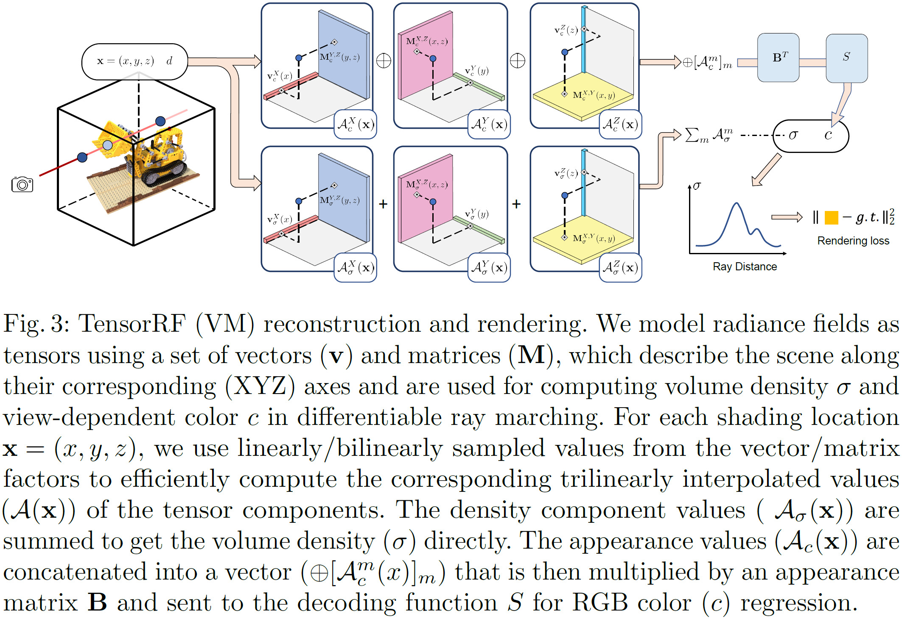

# TensoRF: Tensorial Radiance Fields

## 0 Abstract

与纯粹使用 MLP 的 NeRF 不同，我们将场景的辐射场建模为 4D 张量。3D 体素网格的每个体素都具有多通道的特征。
Unlike NeRF that purely uses MLPs, we model the radiance field of a scene as a 4D tensor, which represents a 3D voxel grid with per-voxel multi-channel features.

我们的中心思想是**将 4D 场景张量分解为多个紧凑的低秩张量分量**。
Our central idea is to **factorize the 4D scene tensor into multiple compact low-rank tensor components**.

我们引入了一种新的向量矩阵（VM）分解，它放宽了张量的两种模式的低秩约束，并将张量分解为紧凑向量和矩阵因子。
We introduce a novel vector-matrix (VM) decomposition that relaxes the low-rank constraints for two modes of a tensor and factorizes tensors into compact vector and matrix factors.

## 1 Introduction

我们追求一种新颖的方法，既能节省训练时间，又能减少内存占用，同时实现最先进的渲染质量。
We pursue a novel approach that is both efficient in training time and compact in memory footprint, and at the same time achieves state-of-the-art rendering quality.

我们建议将辐射场的张量分解为**多个低阶张量分量**，从而获得准确而紧凑的场景表示。
We propose to factorize the tensor of radiance fields into multiple **low rank tensor components**, leading to an accurate and compact scene representation. 

虽然与 CP 中基于纯矢量的分解相比，这增加了模型大小，但我们使每个组件都能够表达更高等级的更复杂的张量数据，从而显着减少了辐射场建模所需的组件数量，并带来更好的渲染质量。
While this increases the model size compared to pure vector-based factorization in CP, we enable each component to express more complex tensor data of higher ranks, thus significantly reducing the required number of components in radiance field modeling and leading to better rendering quality.

与之前直接重建体素的工作相比，我们的张量分解将空间复杂度从 $O(n^3)$ 降低到 $O(n)$（使用 CP）或 $O(n^2)$（使用 VM），显着降低内存占用。
In contrast to previous works that directly reconstruct voxels, our tensor factorization reduces space complexity from $O(n^3)$ to $O(n)$ (with CP) or $O(n^2)$ (with VM), significantly lowering memory footprint.

## 2 Related Work

### 2.1 Tensor Decomposition

Tucker decomposition, CP decomposition, singular value decomposition (SVD).

### 2.2 Scene representations and radiance fields

## 3 CP and VM Decomposition

### 3.1 CP Decomposition

给定一个 3D 张量 $\mathcal T\in\mathbb R^{I\times J\times K}$，CP 分解将其分解为向量外积的总和
Given a 3D tensor $\mathcal T\in\mathbb R^{I\times J\times K}$, CP decomposition factorizes it into a sum of outer products of vectors
$$
\mathcal T=\sum_{r=1}^{R}\mathbf v_r^1\circ\mathbf v_r^2\circ\mathbf v_r^3
$$
其中 $\mathbf v_r^1\circ\mathbf v_r^2\circ\mathbf v_r^3$ 对应一个**秩一张量**分量，$\mathbf v_r^1\in\mathbb R^I$, $\mathbf v_r^2\in\mathbb R^J$ 和 $\mathbf v_r^3\in\mathbb R^K$ 是 $r^{th}$ 分量的三种模式的分解向量。
where $\mathbf v_r^1\circ\mathbf v_r^2\circ\mathbf v_r^3$ corresponds to a **rank-one tensor** component, and $\mathbf v_r^1\in\mathbb R^I$, $\mathbf v_r^2\in\mathbb R^J$, and $\mathbf v_r^3\in\mathbb R^K$ are factorized vectors of the three modes for the $r^{th}$ components.
$$
\mathcal T_{ijk}=\sum_{r=1}^R\mathbf v_{r,i}^1\circ\mathbf v_{r,j}^2\circ\mathbf v_{r,k}^3
$$
然而，由于过于紧凑，CP分解可能需要许多组件来模拟复杂的场景，导致辐射场重建的计算成本很高。
However, because of too high compactness, CP decomposition can require many components to model complex scenes, leading to high computational costs in radiance field reconstruction.

### 3.2 Vector-Matrix Decomposition

$$
\mathcal T=\sum_{r=1}^{R_1}\mathbf v_r^1\circ\mathbf M_r^{2,3}+\sum_{r=1}^{R_2}\mathbf v_r^2\circ\mathbf M_r^{1,3}+\sum_{r=1}^{R_3}\mathbf v_r^3\circ\mathbf M_r^{1,2}
$$

$\mathbf M_r^{2,3}\in\mathbb R^{J\times K},\mathbf M_r^{1,3}\in\mathbb R^{I\times K},\mathbf M_r^{1,2}\in\mathbb R^{I\times J}$

对于每个分量，我们将其两个模式的秩放宽为任意大，同时将第三个模式限制为秩一。
For each component, we relax its two mode ranks to be arbitrarily large, while restricting the third mode to be rank-one.

请注意，我们的每个分量张量都比 CP 分解中的一个分量具有更多参数。虽然这会导致较低的紧凑性，但 VM 分量张量可以表示比 CP 分量更复杂的高维数据，从而在建模相同复杂的函数时减少所需的分量数量。 另一方面，VM 分解仍然具有非常高的紧凑性，与密集网格表示相比，将内存复杂度从 $O(N^3)$ 降低到 $O(N^2)$。
Note that, each of our component tensors has more parameters than a component in CP decomposition. While this leads to lower compactness, a VM component tensor can express more complex high-dimensional data than a CP component, thus reducing the required number of components when modeling the same complex function. On the other hand, VM decomposition is still of very high compactness, reducing memory complexity from $O(N^3)$ to $O(N^2)$ compared to dense grid representations.

### 3.3 Tensor for Scene Modeling

$$
\mathcal T=\sum_{r=1}^{R}\left(\mathbf v_r^X\circ\mathbf M_r^{Y,Z}+\mathbf v_r^Y\circ\mathbf M_r^{X,Z}+\mathbf v_r^Z\circ\mathbf M_r^{X,Y}\right)\\
\mathcal T_{ijk}=\sum_{r=1}^R\sum_{\star}A^{\star}_{r,ijk}\quad\star\in\{X,Y,Z\}
$$

## 4 Tensorial Radiance Field Representation

### 4.1 Feature Grids and Radiance Field

我们将常规 3D 网格 $\mathcal G$（按特征通道）拆分为几何网格 $\mathcal G_{\sigma}$ 和外观网格 $\mathcal G_c$，分别建模体积密度 $\sigma$ 和视角相关的颜色$c$。
We split a regular 3D grid $\mathcal G$ (by feature channels) into a geometry grid $\mathcal G_{\sigma}$ and an appearance grid $\mathcal G_c$, separately modeling the volume density $\sigma$ and view-dependent color $c$.

我们的方法支持 $\mathcal G_c$ 中的各种类型的外观特征，这取决于将外观特征向量和观察方向 $d$ 转换为颜色 $c$ 的预选函数 $S$。$S$ 可以是一个小的 MLP 或球谐函数（SH），其中 $\mathcal G_c$ 分别包含神经特征和 SH 系数。
Our approach supports various types of appearance features in $\mathcal G_c$, depending on a pre-selected function $S$ that coverts an appearance feature vector and a viewing direction $d$ to color $c$. $S$ can be a small MLP or spherical harmonics (SH) functions, where $\mathcal G_c$ contains neural features and SH coefficient respectively.

我们考虑一个单通道网格 $\mathcal G_{\sigma}$，其值直接表示体积密度，不需要额外的转换函数。
We consider a single-channel grid $\mathcal G_{\sigma}$​ whose values represent volume density directly, without requiring an extra converting function.
$$
\sigma=\mathcal G_{\sigma}(\mathbf x),c=S(\mathcal G_c(\mathbf x),d)
$$
其中 $\mathcal G_{\sigma}(\mathbf x)$ 和 $\mathcal G_c(\mathbf x)$ 由 $\mathbf x$ 所在格子三线性插值得来。

$\mathcal G_{\sigma}\in\mathbb R^{I\times J\times K}$, $\mathcal G_c\in\mathbb R^{I\times J\times K\times P}$, $I,J,K$ 是沿着 $X,Y,Z$ 轴对应的分辨率，$P$ 是特征向量的通道数。
$$
\mathcal G_{\sigma}:\mathbb{R}^3\mapsto\mathbb{R}\quad\mathcal G_{c}:\mathbb{R}^3\mapsto\mathbb{R}^P
$$

### 4.2 Factorizing Radiance Fields

$$
\mathcal G_{\sigma}=\sum_{r=1}^{R_{\sigma}}\left(\mathbf v_{\sigma,r}^X\circ\mathbf M_{\sigma,r}^{Y,Z}+\mathbf v_{\sigma,r}^Y\circ\mathbf M_{\sigma,r}^{X,Z}+\mathbf v_{\sigma,r}^Z\circ\mathbf M_{\sigma,r}^{X,Y}\right)=\sum_{r=1}^{R_{\sigma}}\sum_{\star}A_{\sigma,r}^{\star}\quad\star\in\{X,Y,Z\}
$$

外观张量 $\mathcal G_c$ 具有对应于特征通道维度的附加模式。请注意，与 $X,Y,Z$ 模式相比，此模式通常具有较低的维度，导致秩较低。因此，我们没有将这种模式与矩阵因子中的其他模式结合起来，而是只使用向量，在分解中用 $\mathbf b_r$ 表示这种模式。
The appearance tensor $\mathcal G_c$ has an additional mode corresponding to the feature channel dimension. Note that, compared to the $X,Y,Z$ modes, this mode is often of lower dimension, leading to a lower rank. Therefore, we do not combine this mode with other modes in matrix factors and instead only use vectors, denoted by $\mathbf b_r$ for this mode in the factorization.
$$
\begin{align*}
\mathcal G_c&=\sum_{r=1}^{R_{c}}\left(\mathbf v_{c,r}^X\circ\mathbf M_{c,r}^{Y,Z}\circ\mathbf b_{3r-2}+\mathbf v_{c,r}^Y\circ\mathbf M_{c,r}^{X,Z}\circ\mathbf b_{3r-1}+\mathbf v_{c,r}^Z\circ\mathbf M_{c,r}^{X,Y}\circ\mathbf b_{3r}\right)\\
&=\sum_{r=1}^{R_{c}}\left(A_{c,r}^X\circ\mathbf b_{3r-2}+A_{c,r}^Y\circ\mathbf b_{3r-1}+A_{c,r}^Z\circ\mathbf b_{3r}\right)\\
\end{align*}
$$
请注意，我们有 $3R_c$ 个向量 $\mathbf b_r$ 来匹配分量的总数。
Note that we have $3R_c$ vectors $\mathbf b_r$ to match the total number of components.

一般来说，我们采用 $R_{\sigma}\ll I,J,K$ 和 $R_{c}\ll I,J,K$ 导致可以编码高分辨率密集网格的高度紧凑的表示。
In general, we adopt $R_{\sigma}\ll I,J,K$ and $R_{c}\ll I,J,K$ leading to a highly compact representation that can encode a high-resolution dense grid.

外观特征模式向量 $\mathbf b_r$ 表示全局外观相关性。通过将所有 $\mathbf b_r$ 作为列堆叠在一起，我们有一个 $P\times3R_c$ 矩阵 $B$； 这个矩阵 $B$ 也可以看作是一个全局外观字典，它抽象了整个场景的外观共性。
The appearance feature-mode vectors $\mathbf b_r$ express the global appearance correlations. By stacking all $\mathbf b_r$ as columns together, we have a $P\times3R_c$ matrix $B$; this matrix $B$ can also be seen as a global appearance dictionary that abstracts the appearance commonalities across the entire scene.

### 4.3 Efficient Feature Evaluation

#### Direct evaluation

$$
\mathcal G_{\sigma,ijk}=\sum_{r=1}^{R_{\sigma}}\sum_{\star}A_{\sigma,r,ijk}^{\star}\quad\star\in\{X,Y,Z\}
$$

$$
\mathcal G_{c,ijk}=\sum_{r=1}^{R_{c}}\left(A_{c,r,ijk}^X\circ\mathbf b_{3r-2}+A_{c,r,ijk}^Y\circ\mathbf b_{3r-1}+A_{c,r,ijk}^Z\circ\mathbf b_{3r}\right)
$$

在这里，特征模式没有额外的索引，因为我们计算了一个完整的向量。
Here, there’s no additional indexing for the feature mode, since we compute a full vector.

我们将 $\oplus[A_{c,ijk}^\star]_{\star,r}$ 表示为堆叠的所有 $A_{c,r,ijk}^{\star}$ 值的向量 $\star\in\{X,Y,Z\}$ 和 $r\in\{1,\dots,R_c\}$，这是一个 $3R_c$ 维度的向量；在实践中，$\oplus$ 也可以被视为将所有标量值（1 通道向量）连接成 $3R_c$ 通道向量的连接运算符。
We denote $\oplus[A_{c,ijk}^\star]_{\star,r}$ as the vector that stacks all $A_{c,r,ijk}^{\star}$ values for $\star\in\{X,Y,Z\}$ and $r\in\{1,\dots,R_c\}$, which is a vector of $3R_c$ dimensions; $\oplus$ can also be considered as the concatennation operator that concatenates all scalar values (1-channel vectors) into a $3R_c$-channel vector in practice.
$$
\mathcal G_{c,ijk}=B(\oplus[A_{c,ijk}^\star]_{\star,r})
$$

#### Trilinear interpolation

三线性插值一个网格的值等效于插值三个分量在相乘。例如我们想得到 $A_r^X(\mathbf x)$ 处的值，其中 $\mathbf x=(x,y,z)$​。
$$
A_r^X(\mathbf x)=[\mathbf v_r^X\circ\mathbf M_r^{Y,Z}](\mathbf x)
$$
由于外积是线性映射，因此可以分解：
$$
A_r^X(\mathbf x)=\mathbf v_r^X(x)\mathbf M_r^{Y,Z}(y,z)
$$
因此：
$$
\mathcal G_{\sigma}(\mathbf x)=\sum_{r=1}^{R_{\sigma}}\sum_{\star}A_{\sigma,r}^{\star}(\mathbf x)\quad\star\in\{X,Y,Z\}\\
\mathcal G_{c}(\mathbf x)=B(\oplus[A_{c,r}^m(\mathbf x)]_{m,r})
$$

### 4.4 Rendering and Reconstruction

$$
\sigma=\sum_{r=1}^{R_{\sigma}}\sum_{\star}A_{\sigma,r}^{\star}(\mathbf x),c=S(B(\oplus[A_{c,r}^m(\mathbf x)]_{m,r}),d)
$$

#### Volume rendering

Use NeRF's equation:
$$
C=\sum_{q=1}^{Q}T_q(1-\exp(-\sigma_q\Delta_q))c_q\\
T_q=\exp({-\sum_{p=1}^{q-1}\sigma_p\Delta_p})
$$
$\sigma_q,c_q$ 是采样点 $\mathbf x_q$ 处的密度和颜色，$\Delta_q$ 是光线步长，$T_q$ 是透射率。

#### Reconstruction

Gradient descent, L2 loss.
L1 norm loss on vector and total variation loss on matrix.
Coarse to fine.

## 5 Implementation details

我们将特征解码函数 $S$ 实现为 MLP 或 SH 函数，并为两者使用 $P = 27$ 特征。对于 SH，这对应于 RGB 通道的三阶 SH 系数。对于神经特征，我们使用具有两个 FC 层（具有 128 通道隐藏层）和 ReLU 激活的小型 MLP。
We implement the feature decoding function $S$ as either an MLP or SH function and use $P = 27$ features for both. For SH, this corresponds to 3rd-order SH coefficients with RGB channels. For neural features, we use a small MLP with two FC layers (with 128-channel hidden layers) and ReLU activation.

Adam, 0.02 for tensor, 0.001 for MLP.
Batch size 4096

为了实现从粗到细的重建，我们从一个初始的低分辨率网格开始，它具有 $N^3_0$ 体素，$N_0 = 128$； 然后，我们在步骤 $2000、3000、4000、5500、7000$ 处对向量和矩阵进行线性和双线性上采样，体素数量在对数空间中线性插值在 $N^3_0$ 和 $N^3$ 之间。
To achieve coarse-to-fine reconstruction, we start from an initial low-resolution grid with $N^3_0$ voxels with $N_0 = 128$; we then upsample the vectors and matrices linearly and bilinearly at steps $2000, 3000, 4000, 5500, 7000$ with the numbers of voxels interpolated between $N^3_0$ and $N^3$ linearly in logarithmic space.

## 6 Experiments

#### Analysis of different TensoRF models

请注意，TensoRF-CP 和 TensoRF-VM 都可以通过更多组件或更高的网格分辨率始终如一地实现更好的渲染质量。 TensoRF-CP实现超紧凑建模；即使是具有 384 个组件的最大模型 $500^3$ 和体素也需要不到 4MB。
Note that both TensoRF-CP and TensoRF-VM achieve consistently better rendering quality with more components or higher grid resolutions. TensoRF-CP achieves super compact modeling; even the largest model with 384 components $500^3$ and voxels requires less than 4MB.

另一方面，由于在每个组件中压缩了更多的参数，TensoRF-VM 的渲染质量明显优于 TensoRF-CP；$200^3$ 即使是只有 48 个组件和体素的最小 TensoRF-VM 模型也能够胜过使用更多组件和体素的最佳 CP 模型。
On the other hand, because it compresses more parameters in each component, TensoRF-VM achieves significantly better rendering quality than TensoRF-CP; $200^3$ even the smallest TensoRF-VM model with only 48 components and voxels is able to outperform the best CP model that uses many more components and voxels.

#### Optimization steps

我们的紧凑型 CP-384 模型 (3.9MB) 甚至可以在 60k 步后实现大于 32 的 PSNR，高于所有先前方法的 PSNR。 另一方面，我们的 VM 模型可以通过很少的步骤快速实现高渲染质量。
Our compact CP-384 model (3.9MB) can even achieve a PSNR greater than 32 after 60k steps, higher than the PSNRs of all previous methods. On the other hand, our VM models can quickly achieve high rendering quality in very few steps.

#### Comparisons on $360^\circ$ scenes

#### Forward-facing scenes

## 7 Conclusion

## B More Implementation Details

This loss function:
$$
\mathcal{L}=\|C-\tilde{C}\|_2^2+\omega\cdot\mathcal{L}_{\mathrm{reg}}
$$
为了鼓励我们的张量因子参数的稀疏性，我们应用了标准的 L1 正则化，我们发现它可以有效地提高外推视图的质量，并在最终渲染中去除浮动/外部值。
To encourage the sparsity in the parameters of our tensor factors, we apply the standard L1 regularization, which we find is effective in improving the quality in extrapolating views and removing floaters/outerliers in final renderings.
$$
\mathcal{L}_{\mathrm{L1}}=\frac{1}{N}\sum_{r=1}^{R_{\sigma}}(\|\mathbf{M}_{\sigma,r}\|+\|\mathbf{v}_{\sigma,r}\|)
$$

$$
\mathcal{L}_{\mathrm{TV}}=\frac{1}{N}\sum\left(\sqrt{\Delta^2\mathcal{A}_{\sigma,r}^{m}}+0.1\cdot\sqrt{\Delta^2\mathcal{A}_{C,r}^{m}}\right)
$$

$\Delta^2$ 是矩阵或向量相邻元素的差分的平方。

