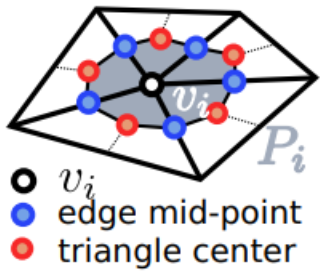

[TOC]

# Sphere-Meshes: Shape Approximation Using Spherical Quadratic Error Metrics

## 0 Abstract

形状近似算法旨在计算密集表面网格的简单几何描述。许多此类算法基于网格抽取技术，生成粗略的三角剖分，同时针对特定度量，如与原始形状的距离，进行优化。
Shape approximation algorithms aim at computing simple geometric descriptions of dense surface meshes. Many such algorithms are based on mesh decimation techniques, generating coarse triangulations while optimizing for a particular metric which models the distance to the original shape.

然而，随着达到更粗略的近似，定义抽取几何的内在分段线性点插值甚至不能捕获简单的结构。
However, as coarser approximations are reached, the intrinsic piecewise linear point interpolation which defines the decimated geometry fails at capturing even simple structures.

我们提出了 Sphere-Meshes，一种为极端近似而设计的新形状表示，并用球面插值代替了表面网格的经典点插值。从技术的角度来看，我们提出了一种新的形状近似算法，从经典的多边形网格中生成指定细节级别的球体网格。我们还引入了一个新的度量来指导这种近似，即 $\R^4$ 中的球面二次误差度量，它的最小化器找到了最接近输入中一组切平面并且对表面方向敏感的球体，从而自然地区分了内部和物体的外部。
We propose Sphere-Meshes, a new shape representation designed for extreme approximations and substituting a sphere interpolation for the classic point interpolation of surface meshes. From a technical point-of-view, we propose a new shape approximation algorithm, generating a sphere-mesh at a prescribed level of detail from a classical polygon mesh. We also introduce a new metric to guide this approximation, the Spherical Quadric Error Metric in $\R^4$, whose minimizer finds the sphere that best approximates a set of tangent planes in the input and which is sensitive to surface orientation, thus distinguishing naturally between the inside and the outside of an object.

最后，我们提出了一个变形控制 App，其中 sphere-mesh 层次结构用作交互式改变输入形状的便捷装备。
Lastly, we propose an application to deformation control where a sphere-mesh hierarchy is used as a convenient rig for altering the input shape interactively.

## 1 Introduction

简化方法基本上可以分为三类：
Simplification method can be essentially be classified in three categories:

1. 聚类方法：将原表面分解为几个区域集合，并用单个代表替换每个区域。
    Clustering methods: decompose the original surface into a collection of regions and substitute each region with a single representative.
2. 抽取方法：迭代地移除表面样本并重新定位它们的邻居以优化原始形状。
    Decimation methods: iteratively remove surface samples and relocate their neighbors to optimize for the original shape.
3. 重采样方法：计算表面上新的、可能更粗糙的点分布并建立新的连通性。
    Resampling methods: compute a new, potentially coarser, point distribution on the surface and establish a new connectivity.

还可以考虑由面围成的体，并通过中轴变换 (MAT) 提供简化。
One can also consider the volume bounded by the surface and provide a simplification by means of the Medial Axis Transform (MAT).

球体网格是一种近似模型，它是一组连接的球体，这些球体沿单纯形（即边或三角形）线性插值。
Sphere-meshes is an approximation model which are a connected set of spheres that are linearly interpolated along simplices (i. e., edges or triangles).

实际上，经典多边形网格是顶点半径为零的球体的一种特殊球体网格。
Indeed, a classical polygon mesh is a special case of a sphere-mesh, where vertices are spheres with zero radius.

粗化近似值，球体网格逐渐从面演变为体，使用球体的半径来建模形状的厚度。
Coarsening the approximation, sphere-meshes progressively evolve from a surface to a volumetric object, using the radius of the spheres to model the thickness of the shape.

我们的度量考虑了法向，并自然地区分了 3D 形状的内部和外部。
Our metric accounts for the normal orientation and distinguishes naturally between the inside and the outside of the 3D shape.

### 1.1 Related Work

#### Mesh Simplification

Quadratic error metric.

我们认为极端网格简化需要定义体而不是面，同时在它们之间提供简单的拓扑结构。
We argue that extreme mesh simplification requires defining volumetric elements instead of surfaces, while providing a simple topological structure between them.

#### Shapes from Volumetric Primitives

例如，3D 表面网格的中轴变换 (MAT) 是在其边界上具有多个最近点的所有 3D 点的集合，并采用由边和面以及半径函数组成的拓扑骨架的形式。
For instance, the medial axis transform (MAT) of a 3D surface mesh is the set of all 3D points having more than one closest point on its boundary and takes the form of a topological skeleton made of edges and faces together with a radius function.

构造立体几何 (CSG) 方法将对象的形状建模为在其叶子上携带简单几何图元并在其内部节点上携带布尔运算的树。
Constructive solid geometry (CSG) methods model the shape of an object as a tree carrying simple geometric primitives on its leaves and boolean operations on its internal nodes.

通常基于在空间二叉树中组织的简单边界基元（例如，球体或盒子），这种结构旨在快速剔除空白空间，但仅在其较粗的级别上提供质量较差的形状近似。
Often based on simple bounding primitives (e.g., spheres or boxes) organized in a spatial binary tree, such structures aim at quickly culling empty space but only provide poor quality shape approximation at their coarser levels.

相比之下，我们的目标是用很少的拟合图元来表示输入 3D 对象，同时我们还考虑了它们在网格子结构的单纯形上的插值。
In contrast, we aim at representing the input 3D object with few fitting primitives while we also consider their interpolation over the simplices of a mesh sub-structure.

#### Sphere Skeletons

与这些方法相比，我们建议使用球体插值自动逼近现有的、可能密集的网格（例如，扫描的几何）。此外，我们的球体网格表示将插值扩展到骨架之外，还使用多边形对非管状区域进行建模。
In contrast to these methods, we propose to approximate automatically an existing, possibly dense mesh (e.g., scanned geometry), with an interpolation of spheres. Additionally, our sphere-mesh representation extends the interpolation beyond skeletons, using polygons as well to model non-tubular regions.

### 1.2 Overview

1. 由具有附加连通性信息的球体集组成的球体网格表示 - 每个单纯形对应于四维点 $(q_i,r_i)$ 的线性插值，其中 $q_i=(x_i,y_i,z_i)$ 是球体中心，$r_i$ 是它们的半径；这种表示扩展了现有的基于骨架的球体插值。
    The sphere-mesh representation composed of a sphere set with additional connectivity information - each simplex corresponding to the linear interpolation of the four dimensional points $(q_i,r_i)$, with $q_i=(x_i,y_i,z_i)$ the sphere centers and $r_i$ their radii; this representation extends existing skeleton-based sphere interpolations.
2. 球面二次误差度量 (SQEM) 指导球体网格近似，其最小化器是在最小二乘意义上拟合一组平面的球体。
    The spherical quadric error metric (SQEM) guiding the sphere-mesh approximation and whose minimizer is a sphere fitting a set of planes in the least squares sense.
3. 一种形状近似算法，可从输入三角形网格有效地计算球体网格，并通过重要性图进行可选的局部近似控制。
    A shape approximation algorithm which computes a sphere-mesh efficiently, from an input triangle mesh, with optional local approximation control through an importance map.
4. 使用球形网格作为自动多分辨率控制结构的交互式自由变形框架。
    An interactive freeform deformation framework using sphere-meshes as automatic multi-resolution control structures.

## 2 Sphere-Mesh Representation

#### Notations

|       Symbols        |                         Descriptions                         |
| :------------------: | :----------------------------------------------------------: |
|        $E,T$         |   $E$: edges, $T$: triangles, the mesh to be approximated    |
| $S=\{S(q_i,r_i)\}_i$ | $S$: sphere set, $q_i\in\R^3$: center, $r_i\in\R$: radius which will be linearly interpolated along $E$ and $T$ |
|    $M^{ij}_{kl}$     | the $\R^{(k-i+1)\times(l-j+1)}$-sub-matrix of $M$ whose top left corner if $M_{ij}$ and bottom right is $M_{kl}$ |
|  $\{p,n\}^{\perp}$   | the plane that is orthogonal to $n$ and intersects $p:\{p,n\}^{\perp}\equiv\{x\mid n^T(p-x)=0\}$, which means all the $x$ forms the plane |

$[S_i,S_j]$ 模拟了 $S_i$ 和 $S_j$ 之间的插值球的并集 ($[S_i,S_j]=\cup\{S(uq_i+(q-u)q_j,ur_i+(1-u) q_J)\}$)，且对应于$S_i\cup S_j$ 的凸包。
A segment $[S_i,S_j]$ models the union of the interpolated spheres between $S_i$ and $S_j$ ($[S_i,S_j]=\cup\{S(uq_i+(q-u)q_j,ur_i+(1-u)q_J)\}$), and corresponds to the convex hull of $S_i\cup S_j$.

从形态学的角度来看，球面网格 $\{S,E,T\}$ 对应于由球心定义的多边形网格与具有空间变化半径的球面的 Minkowski 和。人们还可以将球体网格视为内核隐式曲面的参数对应物。
From a morphological point of view, a sphere-mesh $\{S,E,T\}$ corresponds to a Minkowski sum of the polygon mesh defined by the sphere centers with a sphere having a spatially-varying radius. One can also see sphere-meshes as a parametric counterpart to kernel implicit surfaces.

### 2.1 Spherical Quadratic Error Metrics

首先定义球到有向平面的有符号距离：
The signed distance from sphere to the (oriented) plane:
$$
\color{red}\mathrm{d}(S(q,r),\{p,n\}^{\perp})=n^T(p-q)-r\tag{1}
$$
它考虑了法线的方向，并自然地区分了凸区域和凹区域。
It also takes into account the orientation of the normals, and distinguishes naturally between convex and concave regions.

使用齐次坐标：
Using homogeneous coordinate:
$$
\mathrm{d}(S(q,r),\{p,n\}^{\perp})=\bar{n}^T(\bar{p}-s)\\
\bar{n}=(n, 1), \bar{p}=(p,0), s=(q,r)
$$
SQEM: 球到有向平面的有符号距离的平方
$$
\color{red}\begin{align*}
\mathrm{SQEM}(p,n,s)&=\mathrm{d}^2(s,p,n)\\
&=(\bar{n}^T(\bar{p}-s))^2=(\bar{n}^T\bar{p}-\bar{n}^Ts)^2\\
&=(\bar{n}^T\bar{p})^2+(\bar{n}^Ts)^2-2(\bar{n}^T\bar{p})(\bar{n}^Ts)\\
&=s^T(\bar{n}\bar{n}^T)s-(2\bar{n}^T\bar{p}\bar{n}^T)s+(\bar{n}\cdot\bar{p})^2
\end{align*}\tag{2}
$$
定义：

| $\mathrm{SQEM}(p,n,s)=Q(s)=\frac{1}{2}s^TAs-b^Ts+c$  |
| :--------------------------------------------------: |
| $Q\equiv(A,b,c)\in\R^{4\times4}\times\R^{4}\times\R$ |
|        $A=2\bar{n}\bar{n}^T\in\R^{4\times4}$         |
|              $b=2n^Tp\bar{n}\in\R^{4}$               |
|                  $c=(n^Tp)^2\in\R$                   |

容易验证，$Q$ 是线性空间。

### 2.2 Shape Approximation

我们的目标是将输入的网格划分为 $I_k$ 个区域（顶点集合），使得每个区域的几何形状 $P_{I_k}$ 被一个球体 $s_k$ 近似，并且从网格到其近似的平方距离的积分最小。这种划分的成本是：
Our goal is to partition the input mesh into regions $I_k$ (sets of vertices), such that each region geometry $P_{I_k}$ is approximated by a sphere $s_k$ and the integral of the squared distance from the mesh to its approximation is minimized. The cost of such a partition is:
$$
\mathfrak{C}(\{I_k,s_k\}_k)=\sum_{k}\int_{\xi\in P_{I_k}}\mathrm{d}^2(s_k,\{p_\xi,n_\xi\}^{\perp})\mathrm{d}\sigma_\xi\tag{3}
$$
注意，由于我们的目标是形状近似，这个能量并不强制要求球体严格保持在形状内。
Note that since we target shape approximation, this energy does not enforce the spheres to remain strictly inside the shape.

我们为输入网格的每个顶点 $v_i$ 配备由其三分之一相邻三角形（记为 $T_1(v_i)$）给出的所谓重心单元 $P_i$，并定义从球体 $s$ 到 $P_i$ 的 $\mathcal{L} _2$ 平方距离作为到 $s$ 的平方距离在 $P_i$ 上的积分：
We equip each vertex $v_i$ of the input mesh with its so-called barycentric cell $P_i$ given by one third of its adjacent triangles (denoted by $T_1(v_i)$), and define the squared $\mathcal{L}_2$ distance from a sphere $s$ to $P_i$ as the integral over $P_i$ of the squared distance to $s$:
$$
\mathrm{d}(s,P_i)_{\mathcal{L}_2}^2=\int_{\xi\in P_{I_k}}\mathrm{d}^2(s_k,\{p_\xi,n_\xi\}^{\perp})\mathrm{d}\sigma_\xi
$$
这个三分之一是中心和两边的边中点相连得到的。图中任意一个白-蓝-红-蓝-白四边形都占着所在三角形的三分之一面积。

请注意，在每个相邻的三角形 $t_j$ 上，与球体的平方距离是恒定的（因为 $t_j$ 上的所有有向点描述的是同一个平面），并由其用 $Q_{t_j}(s)$ 表示的球面四边形给出。从 $P_i$ 到球体 $s$ 的平方距离简单地由与顶点 $v_i$ 相邻的三角形的球面二次曲线 $Q_{t_j}$ 的加权和给出：
Note that the squared distance to the sphere is constant on each adjacent triangle $t_j$ (since all oriented points on $t_j$ describe the same plane) and is given by its spherical quadric, denoted by $Q_{t_j}(s)$. The squared distance from $P_i$ to a sphere $s$ is simply given by a weighted sum of the spherical quadrics $Q_{t_j}$ of the triangles that are adjacent to the vertex $v_i$:
$$
\mathrm{d}(s,P_i)_{\mathcal{L}_2}^2=\sum_{t_j\in T_1(v_i)}\frac{\mathrm{area}(t_j)}{3}Q_{t_j}(s)=Q_i(s)\tag{4}
$$
每个区域 $P_{I_k}$ 被定义为其顶点 $I_k$ 的重心单元的并集，从球体 $s$ 到 $P_{I_k}$ 的平方距离通过将不同的平方距离相加得出：
Each region $P_{I_k}$ being defined as the union of the barycentric cells of its vertices $I_k$, the squared distance from a sphere $s$ to $P_{I_k}$ is given by summing up the different squared distance:
$$
\mathrm{d}(s,P_i)_{\mathcal{L}_2}^2=\sum_{i\in I_k}\mathrm{d}^2(s,P_i)\triangleq Q_{I_k}(s)\tag{4}
$$
其中 $Q_{I_k}=\sum_{i\in I_k}Q_i$ 是集合 $I_k$ 中顶点的单元的球面二次曲线之和。
where $Q_{I_k}=\sum_{i\in I_k}Q_i$ is the sum of the spherical quadrics of the cells of the vertices in the set $I_k$.

使用这个符号，划分的成本 $\{I_k,s_k\}_k$，定义为从输入表面到球体集的平方 $\mathcal{L}_2$ 距离，是：
Using this notation, the cost of a partition $\{I_k,s_k\}_k$, defined as the squared $\mathcal{L}_2$ distance from the input surface to the set of spheres, is:
$$
\mathfrak{C}(\{I_k,s_k\}_k)=\sum_{k}Q_{I_k}(s_k)\tag{5}
$$

$$
\begin{align*}
\mathfrak{C}(\{I_k,s_k\}_k)&=\sum_{k}Q_{I_k}(s_k)\\
&=\sum_{k}\sum_{i\in I_k}\mathrm{d}^2(s_k,P_i)\\
&=\sum_{k}\sum_{i\in I_k}\sum_{t_j\in T_1(v_i)}\frac{\mathrm{area}(t_j)}{3}Q_{t_j}(s_k)
\end{align*}
$$

#### Quadratic Minimization

每个球面二次曲面 $Q$ 都有一个全局最小值（因为 A 是构造上的对称半正定矩阵），但是它可能不是唯一的。
Each spherical quadric $Q$ has a global minimum (since A is a symmetric positive semi-definite matrix by construction), which may not be unique, however.

由于我们将自己限制在半径为正的球体集合中（半径为负的球体描述的是凹的几何，位于物体之外），这个四边形的最小化是在半空间 $\R^3\times\R^+$ 中进行的。
Since we limit ourselves to the set of spheres that have a positive radius (spheres with a negative radius describe concavities, and are located outside the object), the minimization of this quadric is performed in the half-space $\R^3\times\R^+$.

如果 $A$ 是可逆的，则最小化器是 $A^{-1}b$。当 $\R^4$ 中的全局最小值位于另一个半空间时（即 $r$ 为负），限制上的最小值（即$r\ge0$）会在超平面 $r=0$ 中找到。否则，这个最小值将有一个完全包含在 $r\ge0$ 中的局部邻域，因此将是一个局部最小值，这是不可能的，因为一个非退行四边形正好有一个局部，因此是全局最小值。
The minimizer is given by $A^{-1}b$ if $A$ is invertible. When the global minimizer in $\R^4$ is located in the other half-space (i.e., the fourth coordinate $r$ is negative), the minimizer on the restriction (i.e., $r\ge0$) is found in the hyper-plane $r = 0$. Otherwise this minimizer would have a local neighborhood entirely contained in $r\ge0$, and would be therefore a local minimum, which is impossible since a non-degenerate quadric has exactly one local, hence global, minimum.

## 3 Approximation Algorithm

由于球体网格将一个表面建模为其球体插值的外部边界，我们的近似算法的理想输入是一个封闭的可定向表面。
Since a sphere-mesh models a surface as the outer boundary of the interpolation of its spheres, an ideal input to our approximation algorithm is a closed orientable surface.

### 3.1 Basic Algorithm

我们通过以贪心方式迭代地折叠其边来减少输入网格，按成本 $Q_I(s)$ 对减少操作进行排序，$I$ 是完全折叠的连接顶点集，$s$ 是近似区域的球体。
We reduce the input mesh by collapsing its edges iteratively in a greedy fashion, ordering the reduction operations by the cost $Q_I(s)$, $I$ being the connected set of vertices collapsed altogether, and $s$ being the sphere approximating the region.

当考虑折叠网格边 $uv$ 时，我们创建二次函数 $Q_{uv}=Q_u+Q_v$，找到最接近构造区域的球体 $s_{uv}=\arg\min_s\{Q_{uv}(s)\}$，并将 $uv$ 对应的折叠成本 $c_{uv}$ 设为 $Q_{uv}(s_{uv})$。然后将建议折叠的边 $[uv]\to s_{uv}$ 及其相关成本 $c_{uv}$ 放入优先级队列 $\mathcal{Q}$。
When considering the collapse of an edge $uv$ of the mesh, we create the quadric $Q_{uv}=Q_u+Q_v$, find the sphere that best approximates the constructed region $s_{uv}=\arg\min_s\{Q_{uv}(s)\}$, and set the corresponding collapse cost $c_{uv}$ of $uv$ to $Q_{uv}(s_{uv})$. The suggested edge-collapse $[uv]\to s_{uv}$ is then put into a priority queue $\mathcal{Q}$ with its associated cost $c_{uv}$.

首先，优先级队列 $\mathcal{Q}$ 被初始化为所有可能的折叠边。当从 $\mathcal{Q}$ 中剪出最好的元素 $[uv]\to s_{uv}$ 时，边 $uv$ 被折叠，一个新的顶点以相应的二次函数 $Q_{uv}$ 被创建，所有可能的折叠边与邻居被放入队列，以前的邻居被删除。当达到要删除的顶点数（即球心）时，算法停止。
At first, the priority queue $\mathcal{Q}$ is initialized with all possible edge-collapses. When pruning the best element $[uv]\to s_{uv}$ from $\mathcal{Q}$, the edge $uv$ is collapsed, a new vertex is created with the corresponding quadric $Q_{uv}$, all possible edge-collapses with its neighbors are put into the queue and former neighboring ones are removed. The algorithm stops when the number of vertices (i.e., sphere centers) to delete is reached.

- 如果 $A$ 是可逆的：我们用 $\R^3\times\R^+$ 中的球体来近似该区域。
    If $A$ is invertible: we approximate the region with a sphere in the domain $\R^3\times[0,R]$.
- 如果 $A$ 不可逆（例如，该区域是平面的）：我们沿线段 $[uv]$ 用球体近似该区域，但仍将半径限制在 $[0,R]$ 内（即 $[uv]\times[0,R]$)。
    If $A$ is not invertible (e.g., the region is planar): we approximate the region with a sphere along the segment $[uv]$, still restricting the radius to be in $[0,R]$ (i. e., in the domain $[uv]\times[0,R]$).

对于不可逆的情况：
$$
\begin{align*}
q&=u+\lambda\overrightarrow{uv}\\
Q(q,r)&=\frac{1}{2}(\lambda,t)^T\tilde{A}(\lambda,t)-\tilde{b}^T(\lambda,t)+\tilde{c}\\
\tilde{A}&=\begin{bmatrix}\overrightarrow{uv}^TA^{11}_{33}\overrightarrow{uv}&{A^{41}_{43}}^T\overrightarrow{uv}\\{A^{41}_{43}}^T\overrightarrow{uv}&A^{44}_{44}\end{bmatrix}\\
\tilde{b}&=\begin{bmatrix}{b^{1}_{3}}^T\overrightarrow{uv}-\overrightarrow{uv}^TA^{11}_{33}u\\b^{4}_{4}-{A^{41}_{43}}^Tu\end{bmatrix}\\
\tilde{c}&=c-{b^{1}_{3}}^Tu+\frac{1}{2}u^TA^{11}_{33}u
\end{align*}
$$
全局最小值是：
$$
(\lambda,r)=\tilde{A}^{-1}\tilde{b}
$$
我们希望将这个全局最小值限制在 $[0,1]\times[0,R]$ 上。

如果 $\tilde{A}$ 也不可逆，就指定 $\lambda=1/2$，并在 $r\in[0,R]$ 上找最小值。

#### Mesh Data Structure

非流形网格的多分辨率拓扑表示。
A multi-resolution topological representation for non-manifold meshes.

#### Radius Bound

如果表面部分本身不够大（提供的信息太少），则使用大球体逼近表面可能会很麻烦，并且在这种情况下，生成的球体可以覆盖对象外部的大部分。例如，无限数量的球体能过拟合单个平面，因为唯一的要求是该平面接触球体。
Approximating a surface using a large sphere can be cumbersome if the surface portion is not large enough itself (too little information provided), and the resulting sphere can cover a large part of the outside of the object in this case. For example, an infinite number of spheres can fit a single plane, since the only requirement is that this plane touches the sphere.

为了解决这个问题，我们通过区域的方向宽度 $\mathcal{W}$（即，考虑所有可能的方向时，该区域的最小范围）来限制球体的直径。
To solve this problem, we bound the diameter of the sphere by the directional width $\mathcal{W}$ of the region (i.e., the smallest extent of the region, when considering all possible directions).

我们使用固定数量的方向 $k_j$（在我们的实现中为 30，加上 3 个标准轴）均匀地对单位球体进行预采样。每个区域 $P_u$ 存储其区间 $\mathfrak{J}_j(P_u)$ 沿所有方向 $k_j$，其中 $\mathfrak{J}_j(P_u)=[m^j_u;M^j_u]$，$m^ j_u=\min_{x\in P_u}(x^Tk_j)$ 和 $M^j_u=\max_{x\in P_u}(x^Tk_j)$。两个区域 $P_u$ 和 $P_v$ 可以通过迭代所有方向得到 $k_j(\mathfrak{J}_j(P_u\cup P_v))=[\min(m^j_u,m^j_v);\max(M^j_u,M^ j_v)]$。
We pre-sample the unit sphere uniformly with a fixed number of directions $k_j$ (30 in our implementation, plus the 3 canonical axes). Each region $P_u$ stores its interval $\mathfrak{J}_j(P_u)$ along all directions $k_j$ ($\mathfrak{J}_j(P_u)=[m^j_u;M^j_u]$ with $m^j_u=\min_{x\in P_u}(x^Tk_j)$ and $M^j_u=\max_{x\in P_u}(x^Tk_j)$), and the intervals of the union of two regions $P_u$ and $P_v$ can be obtained by iterating over all directions $k_j(\mathfrak{J}_j(P_u\cup P_v))=[\min(m^j_u,m^j_v);\max(M^j_u,M^j_v)]$.

首先，每个区域 $P_i$ 仅由一个顶点 $v_i$ 的重心单元组成，因此这些区域用 $\mathfrak{J}_j(P_u)=[m^j_u;M^j_u]$ 初始化。区域 $P$ 的方向宽度 $\mathcal{W}(P)$ 近似为 $\tilde{\mathcal{W}}(P)=\min_j|\mathfrak{J}_j(P)|$。为了在归约的第一阶段允许更粗略的近似，我们将代表区域 $P_u$ 的球体的最大直径设置为稍大（$R(P_u)=\frac{3}{4}\tilde{\mathcal{W}}(P_u)$ 在实践中）。
Since, at first, each region $P_i$ is composed of only the barycentric cell of one vertex $v_i$, these are initialized with $\mathfrak{J}_j(P_u)=[m^j_u;M^j_u]$. The directional width $\mathcal{W}(P)$ of the region $P$ is approximate by $\tilde{\mathcal{W}}(P)=\min_j|\mathfrak{J}_j(P)|$. To allow coarser approximations at the first stages of the reduction, we set the maximum diameter of the sphere representing a region $P_u$ to be slightly larger ($R(P_u)=\frac{3}{4}\tilde{\mathcal{W}}(P_u)$ in practice).

这种边界启发函数显示了几个好处：（i）表示平面区域的球体被约束为一个点，因为平面的方向宽度为零； (ii) 对于凸物体，当球体与几何形状相切时，球体很可能（尽管不能保证）留在形状内（因为集合的方向宽度等于其凸包的方向宽度）。
This bounding heuristic shows several benefits: (i) a sphere representing a planar region is constrained to be a point, as the directional width of a plane is zero; (ii) for convex shapes, a sphere is likely (although not guaranteed) to remain inside the shape when it is tangent to the geometry (as the directional width of a set equals that of its convex hull).

#### Neighborhood Enrichment

对于所有基于抽取的简化方法，如果它们在原始网格中足够接近，即 $|v_a-v_b|<\epsilon$，则折叠网格的两个顶点 $v_a$ 和 $v_b$ 通常很有用。
As for all decimation-based simplification methods, collapsing two vertices of the mesh $v_a$ and $v_b$ is often useful if they are close enough in the original mesh i.e., $|v_a-v_b|<\epsilon$.

### 3.2 Importance-Driven Distribution

在形状近似的上下文中，通常允许用户控制过程中特征的相对重要性。我们建议通过在分区成本的定义中引入加权内核 $K_\sigma$ 来参数化我们的近似过程：
In the context of shape approximation, it is common to allow the user to control the relative importance of the features in the process. We propose to parameterize our approximation process by introducing a weighting kernel $K_\sigma$ in the definition of the cost of a partition:
$$
\mathfrak{C}(\{I_k,s_k\}_k)=\sum_{k}\int_{\xi\in P_{I_k}}K_\sigma\mathrm{d}^2(s_k,\{p_\xi,n_\xi\}^{\perp})\mathrm{d}\sigma_\xi\tag{6}
$$
在前面的定义中，$K_\sigma$描述了流形上所有点的各自重要性。
In the previous definition, $K_\sigma$ describes the respective importance of all points on the manifold.

顶点 $v_i$ 的球面二次型 $Q_i$ 是通过对相邻三角形 $t_j\in T_1(v_i)$ 的二次曲线 $Q_{t_j}$ 进行平均得到的，这次考虑了内核的积分 ：
The spherical quadric $Q_i$ of the vertex $v_i$ is given by averaging the quadrics $Q_{t_j}$ of its adjacent triangles $t_j\in T_1(v_i)$ as before, this time taking the integral of the kernel into account:
$$
Q_i=\sum_{t_j\in T_1(v_i)}(\int_{\xi\in P_j\cap t_j}K_\sigma(\xi)\mathrm{d}\sigma_\xi)Q_{t_j}\tag{7}
$$
我们展示了基于总曲率 $\kappa^2_1+\kappa^2_2$ 设置重要性内核时获得的各种结果（这自然有利于高度突出的几何形状）：
We present various results obtained when setting importance kernels based on the total curvature $\kappa^2_1+\kappa^2_2$​ (which naturally favors highly-protruding geometry):
$$
K_\sigma(\xi)=1+\sigma\mathrm{BBD}^2(\kappa^2_1(\xi)+\kappa^2_2(\xi))\tag{8}
$$
$\mathrm{BBD}$是模型的边界盒对角线，确保了尺度不变性。
$\mathrm{BBD}$ being the bounding box diagonal of the model which ensures scale invariance.

## 4 Result

整个算法由两个参数控制：球体的目标数量和 $\sigma$（除非另有说明，否则设置为1）。
The entire algorithm is controlled by two parameters: the target number of spheres and $\sigma$ (set to 1 unless otherwise mentioned).

### 4.1 Interpolated Geometry

每个插值边对应于一个由与每个末端的边正交的平面切割的圆锥，每个插值三角形对应于一个三角形棱柱，该棱柱由 3 个挤压三角形边的面和 2 个三角形组成，用于插值的下壳和上壳。
Each interpolated edge corresponds to a cone cut by a plane orthogonal to the edges at each extremity and each interpolated triangle corresponds to a triangular prism made of 3 faces extruding the triangle edges and 2 triangles for the lower and upper crusts of the interpolation.

### 4.2 Performances

我们还对病态案例进行了实验：骆驼网格模型显示了一个质量很差的输入网格，有许多形状奇异的地方，是如何用球形网格在粗尺度上平滑地逼近的；半熊模型说明了该算法在不完整的数据集上是如何表现的。
We also performed experiments on pathological cases: the Camel grid model shows how a poor quality input mesh, with numerous shape singularities, is smoothly approximated at coarse scale with a sphere-mesh; the Half bear model illustrates how the algorithm behaves for incomplete data sets.

当输入非常嘈杂时，SQEM 最小化自然会导致零半径的球体（即点），因此在这种情况下变得等同于 QEM 最小化。$\sigma$ 的影响也变得不那么关键。
When the input is very noisy, the SQEM minimization leads naturally to zero radius spheres (i.e., points), and thus becomes equivalent to QEM minimization in that case. The impact of $\sigma$ also becomes less critical.

#### Worse Cases Scenarios

我们的方法最糟糕的情况是：薄壳模型包含大型凹面零件和相互包含的断开组件。
The worst case scenarios for our approach: thin-shell models containing large concave parts and disconnected components encompassing each other.

### 4.3 Comparisons

#### Mesh Decimation

球体网格几何插值倾向于“填充”有孔区域，这取决于应用程序，可能是优点或缺点。
The sphere-mesh geometry interpolation tends to “fill” holed regions which, depending on the application, may be a benefit or a drawback.

#### Medial Axis Transform

首先，MAT 也是根据由三角形和边组成的非流形结构上的球面插值来定义的；其次，MAT 还可以通过过滤过程提供输入形状的多分辨率描述。
First, the MAT is defined as well in terms of sphere interpolation over a non-manifold structure composed of triangles and edges; second, the MAT can offer as well a multiresolution description of the input shape, through a filtering process.

首先，球体网格逐渐从表面退化为体积结构，并且球体网格几何的部分可以保持与输入表面同胚。此外，这种从表面结构到体积结构的过渡以自适应方式出现。相比之下，MAT 是纯体积结构。其次，虽然过滤过程也可以提供基于 MAT 的输入形状的多分辨率描述，但这是我们的近似技术的自然副作用。
First, sphere-meshes degenerate from surface to volumetric structures progressively and parts of the sphere-mesh geometry can remain homeomorphic to the input surface. Moreover, this transition from surface to volumetric structures arises in an adaptive manner. In contrast, the MAT is a purely volumetric structure. Second, although a filtering process can also provide a MAT-based multi-resolution description of the input shape, this comes as a natural side effect of our approximation technique.

#### Sphere Skeletons

## 5 Application to Deformation Control

#### Overview

#### Skinning

#### Multi-resolution Freedom Deformation

## 6 Discussion

### 6.1 Limitation and Future Work

#### Representation

目前，球体-网格将表面表示为一个基本的复合体（顶点、三角形 ...）和一个空间变化的厚度（球体半径），但实际的表面几何形状被表示为球体在复合体上的线性内插，不能直接转化为例如三角形网格。
Currently, a sphere-mesh represents the surface as a base complex (vertices, triangles, ...) and a spatially-varying thickness (spheres radius), but the actual surface geometry is expressed as the linear interpolation of the spheres over the complex and is not directly transformable into e.g., a triangle mesh.

#### Incomplete Data and Open Surface

#### Shape Approximation

目前，我们对球体网格的定义并不允许以简单的方式强制要求球体严格保持在形状内，或者要求产生的网格保留输入的拓扑结构，也就是说，在极端的简化水平上可能出现拓扑错误。此外，球体网格可以更好地表示具有少数连接的凸面部分的形状，而具有大的凹面部分的模型仍然需要大量的球体来正确建模。
Currently, our definition of sphere-meshes does not allow to enforce, in a simple manner, that spheres remain strictly inside the shape or that the resulting mesh preserves the input’s topology i.e., topological errors can occur at extreme simplification levels. Furthermore, sphere-meshes represent shapes with few connected convex components better, and models featuring large concave parts still require a large number of spheres to model properly.

#### Optimization

分割也是通过最小化从输入网格到其简化几何的单向 $\mathcal{L}_2$ 距离来计算的，并且可以通过最小化 Hausdorff 距离来进一步改进结果。
The partitioning is also computed by minimizing the one way $\mathcal{L}_2$ distance from the input mesh to its simplified geometry, and the results could be further improved by minimizing the Hausdorff distance instead.

### 6.2 Conclusion

