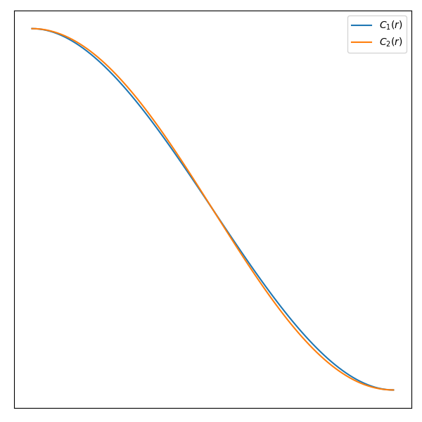

# Data Structure for Soft Objects

## 0 Abstract

软物是一类物体，包括织物、靠垫、活体、泥土和水。
Soft objects is class of objects includes fabrics, cushions, living forms, mud and water.

## 1 Introduction

柔软物体的形状会因周围环境施加在其上的力而不断变化。
The shape of the soft object varies constantly because of the forces imposed on it by its surroundings.

物体被认为占据了函数值大于某个阈值的空间，因此物体的表面是场函数的等值面。
The object is considered to occupy the space over which the function has a value greater than some threshold so the surface of the object is an iso-surface of the field function.

通过适当选择的场函数，我们可以方便地代表各种各样的形状，原则上是以某种方式的任何形状。在本文中，我们专注于基于接近给定数据点的简单函数。我们通过指定这些关键点的运动来实现动画，而不会改变我们的函数。
By suitable choice of field function, we can represent a wide variety of shapes conveniently and in principle, any shape somehow. For this paper we concentrate on simple functions based on proximity to given data points. We achieve animation by specifying the motion of these key points, without otherwise altering our function.

## 2 Space Function or Field

我们想要构造一个函数，使我们能够在绘制等值面时表示任意形状。因此，该功能将取决于一组给定的关键点。我们假设关键点是独立的。
We want to construct a function which will enable us to represent arbitrary shapes when we plot the iso-surfaces. The function is therefore going to depend on a set of given key points. We assume that the key points are independent.

我们使用不受超出一定距离的任何点影响的函数。这个距离被称为影响半径，$R$。
We use a function which is not influenced by any point beyond a certain distance away. This distance is known as the radius of influence, $R$.

根据定义，任何超出其影响半径的关键点对场的贡献 $R$ 为零。点本身位置的贡献将是某个最大值（我们使用 1.0），我们希望场在 $R$ 处平滑下降到零。
By definition, the contribution to the field made by any key point beyond its radius of influence, $R$, is zero. The contribution at the position of the point itself will be some maximum value (We use 1.0) and we would like to arrange that the field drops smoothly to zero at $R$.
$$
\begin{align*}
C(0)=1&&C'(0)=0\\
C(R)=0&&C'(R)=0
\end{align*}
$$
假设有个 $C_1(r)$ 函数
$$
C_1(r)=2\frac{r^3}{R^3}-3\frac{r^2}{R^2}+1
$$
$r$ 是空间中任意一点到选取的关键点的距离，因此计算 3 次方需要开根号。我们用另一个函数：
$$
C_2(r)=-\frac{4r^6}{9R^6}+\frac{17r^3}{9R^3}-\frac{22r^3}{9R^3}+1
$$
作为替代，这样只需要 3 次加法 5 次乘法。

## 3 Defining the Iso-surface

绘制连接场值等于 $m$ 的所有点的等值面。
Plot the iso-surface connecting all points whose field value equals $m$.

提供两个液滴合并时的合理效果。
Provide a reasonable effect when two droplets merge.

## 4 Producing the Surface

想象一下，由表面占据的空间部分被一个三维网格划分为小立方体。首先我们找到与表面相交的所有立方体，然后我们在每个立方体中构造多边形。
Imagine that the part of space occupied by the surface is divided by a three dimensional grid into small cubes. First we find all the cubes which are intersected by the surface and then we construct the polygons in each cube.

为了在不扫描整个大型三维网格的情况下找到与曲面相交的立方体，我们利用了所有关键点都被曲面的某些部分包围的知识。
To find the cubes intersected by the surface without scanning the whole of a large three dimensional grid, we take advantage of the knowledge that all our key points are enclosed by some part of the surface.

上一阶段已经整理出所有与曲面相交的立方体，所以当我们将这些多边形放在一起时，我们就有了曲面的表示。
The previous stage has sorted out all the cubes intersected by the surface, so when we put these polygons together we have a representation of the surface.

## 5 Data Structure

### 5.1 Fast Evaluation of Field Values

第一个问题是能够有效地计算任意点的函数值。
The first problem is to be able to calculate the field value at any point efficiently.

代表整个场景的空间被划分为边长为 $S$ 的立方体。这些立方体中的每一个都由一条记录表示，该记录以指向关键点的指针的链表为首。该链表具有指向那些足够靠近立方体以影响其中的函数的关键点的指针。因此，可以有许多指向给定关键点的指针，特别是如果它具有较大的影响半径 $R$。
The volume of space which represents the whole scene is divided into cubes of side $S$. Each of these cubes is represented by a record which heads a linked list of pointers to key points. The list has pointers to just those key points close enough to the cube to affect the field within it. Thus there can be many pointers to a given key point, especially if it has a large radius of influence $R$.

关键点本身由浮点值的三元组 $(x, y, z)$ 以及方块系数表示，用于快速评估场函数。这些系数是根据设置期间的影响半径计算得出的。
The key points themselves are represented by triples of floating point values, $(x, y, z)$ together with the cubic coefficients for fast evaluation of the field function. These coefficients are calculated from the radius of influence during setting up.

仅表示非空方块，并通过哈希表对其进行访问。表条目是指向方块记录的指针。每条记录都包含一个三元组 $(l, m, n)$，其中 $(lS, mS, nS)$ 代表立方体的“低”顶点。“低”顶点是西南角，或者更正式地说，是最低 $(x, y, z)$ 的顶点。
Only non-empty cubes are represented and they are accessed by means of a hash table. The table entries are pointers to cube records. Each record contains a triple $(l, m, n)$, where $(lS, mS, nS)$ represents the 'low' vertex of the cube. The 'low' vertex is the bottom-south-west corner, or, more formally, the vertex of lowest $(x, y, z)$.

哈希地址是根据 $(l, m, n)$ 三元组计算的。这用作表中的索引。表条目包含一个指向方块记录链表的指针。
The hash address is calculated from the $(l, m, n)$ triple. This is used as an index in the table. The table entry contains a pointer to a linked list of cube records.

### 5.2 The Cubic Net

我们的第二个问题是避免在找到与表面相交的立方体时重新计算函数值。
Our second problem is to avoid recalculating field values as we find the cubes which intersect the surface.
