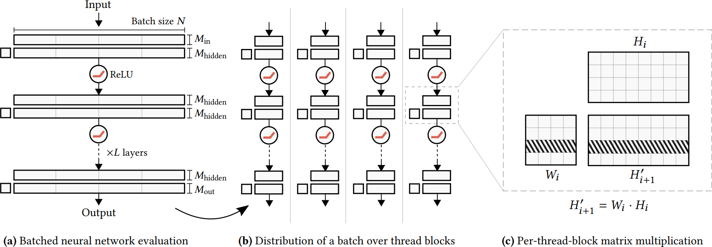

# Realtime Neural Radiance Caching for Path Tracing

## 0 Abstract

我们的系统旨在处理完全动态的场景，并且不对光照、几何形状和材质做任何假设。
Our system is designed to handle fully dynamic scenes, and makes no assumptions about the lighting, geometry, and materials. 

我们的数据驱动方法回避了缓存算法的许多困难，例如定位、插值和更新缓存点。
The data-driven nature of our approach sidesteps many difficulties of caching algorithms, such as locating, interpolating, and updating cache points.

由于预训练神经网络以处理新颖的动态场景是一项艰巨的泛化挑战，因此我们取消了预训练，而是通过适应实现泛化，即我们选择在渲染时训练辐射缓存。
Since pretraining neural networks to handle novel, dynamic scenes is a formidable generalization challenge, we do away with pretraining and instead achieve generalization via adaptation, i.e. we opt for training the radiance cache while rendering.

我们采用自我训练来提供低噪声训练目标，并通过仅迭代少量反弹训练更新来模拟无限反弹传输。
We employ self-training to provide low-noise training targets and simulate infinite-bounce transport by merely iterating few-bounce training updates.

## 1 Introduction

幸运的是，辐射量具有显着的空间、方向和时间相关性，可以通过各种方式利用这些相关性来加速渲染。
Fortunately, radiative quantities feature significant spatial, directional, and temporal correlations, which can be exploited in various ways to accelerate rendering.

一种特别吸引人的方法是缓存辐射样本以供以后重复使用。这可以在预计算步骤中完成，也可以在渲染时完成。
One particularly appealing approach is to cache radiance samples for later reuse. This can be done in a precomputation step, or while rendering.

我们建议通过使用神经辐射缓存来缓解这些困难，因为众所周知，神经网络特别适合替换复杂的启发式算法。
We propose to alleviate these difficulties through the use of a neural radiance cache, as neural networks are known to be particularly apt at replacing complex heuristics.

- **动态内容。**要处理完全交互的内容，系统必须支持相机、照明、几何和材质的任意动态。我们努力寻求不需要预先计算的解决方案。
**Dynamic content.** To handle fully interactive content, the system must support arbitrary dynamics of the camera, lighting, geometry, and materials. We strive for a solution that does not require precomputation.
- **稳健性。**特定案例的处理最终会导致复杂、脆弱的系统。因此，缓存应该与材质和场景几何无关。
**Robustness.** Case-specific handling eventually leads to complex, brittle systems. Hence, the cache should be agnostic of materials and scene geometry.
- **可预测的性能和资源消耗。**工作负载和内存使用的波动会导致帧率不稳定。我们寻求一种具有稳定运行时开销和内存占用的解决方案，这两者都应该独立于场景复杂性。渲染成本必须在最坏的情况下与像素数成线性关系。
**Predictable performance and resource consumption.** Fluctuations in work load and memory usage lead to unstable frame rates. We seek a solution with stable runtime overhead and memory footprint, both of which should be independent of scene complexity. The rendering cost must scale at worst linearly with the number of pixels.

前两个原则 - 动态内容和鲁棒性 - 对预训练的网络提出了一个重大挑战：训练后的模型必须泛化到新的配置，更糟糕的是，内容可能以前从未观察到。
The first two principles - dynamic content and robustness - present a major challenge for pre-trained networks: the trained model must generalize to novel configurations and, worse, content possibly never observed before.

我们提出了两个关键贡献，它们可以通过实时适应进行泛化。首先，我们描述了一种使用（相对）便宜的辐射估计优化网络的有效机制。该机制的核心是神经网络根据其自身在路径的后续顶点的预测进行自我训练，以跟踪单条光线或非常短的路径为代价提供多反射照明。
We present two key contributions that enable generalization via adaptation in real time. First, we describe an efficient mechanism for optimizing the network using (relatively) inexpensive radiance estimates. The core of this mechanism is self-training of the neural network from its own prediction at a later vertex of the path, providing multi-bounce illumination at the cost of tracing single rays or very short paths.

其次，我们提出了一种简化的网络架构，旨在在渲染完全动态的场景时最大限度地权衡质量成本。
Second, we propose a streamlined network architecture designed to maximize the quality-cost tradeoff when rendering fully dynamic scenes.

## 2 Related Work

### 2.1 Radiance Caching

用于模拟漫反射的现代技术遵循相同的假设，即辐照度倾向于在整个场景中平滑变化，并且可以使用反照率调制来恢复纹理细节。
Modern techniques for modeling diffuse inter-reflections follow the same assumption that irradiance tends to vary smoothly across the scene, and texture detail can be recovered using albedo modulation. 

各种缓存记录的插值和定位是这些技术中的一个关键挑战，尤其是当上述关于平滑度的假设不成立时。
The interpolation and location of the various cache records is a key challenge in these techniques, especially when the aforementioned assumptions on smoothness do not hold.

为了处理有光泽的表面，使辐照度缓存算法核心的漫反射假设失效，Křivánek 等人提出使用辐照度缓存，用球谐代表方向域。
In order to handle glossy surfaces, which invalidate the Lambertian assumption at the core of irradiance caching algorithms, Křivánek et al. proposed the use of a radiance cache, representing the directional domain with spherical harmonics.

### 2.2 Precomputation-based Techniques

假设场景照明和几何形状都是固定的，则可以计算辐照度，然后使用光照贴图将其存储在纹理空间中，并使用光照探针将其存储在世界空间中。
Assuming both the scene lighting and geometry are fixed, irradiance can be computed and then stored in texture space using lightmaps and in world space using light probes.

### 2.3 Fully Dynamic Techniques

动态实时全局照明方法建立在有效的渲染算法之上，这些算法在像素之间重用着色和可见性计算，例如光子映射、多光渲染和辐射映射，通过各种近似值进一步提高效率。
Dynamic real-time global illumination methods build upon efficient rendering algorithms that reuse shading and visibility computation across pixels, such as photon mapping, many-light rendering and radiosity maps, extracting further efficiency through various approximations.

除了近似值固有的精度限制（例如模糊、缺少交互或关于材料模型的假设）之外，许多这些技术的一个关键限制是依赖于必须不断刷新的场景的双重表示。
Aside of accuracy limitations inherent to the approximations, such as blurring, missing interactions, or assumptions about the material model, a key limitation of many of these techniques is the reliance on a dual representation of the scene which must be continuously refreshed.

### 2.4 Path Guiding

### 2.5 Neural Techniques

Ren 等人提议训练一组局部神经辐射缓存，以单点光源的位置为条件。虽然可以动态改变光照并且可以使用一组点光照来近似区域光照，但代价是多次缓存查询，但由于训练过程的成本，几何体和材质必须保持静态。我们的技术在两个重要方面有所不同：（i）我们使用单个神经辐射缓存，利用最近提出的编码来适应局部场景变化，以及（ii）我们在线训练我们的模型，它允许完全动态的场景并在单个查询容易考虑所有场景中的照明。
Ren et al. proposes to train a set of local neural radiance caches, conditioned on the position of a single point light source. While lighting can be changed dynamically and area lighting can be approximated using a set of point lights at the cost of multiple cache queries, geometry and materials have to remain static as a consequence of the cost of the training procedure. Our technique differs on two important aspects: (i) we use a single neural radiance cache leveraging recently proposed encodings to adapt to local scene variations, and (ii) we train our model online which allows for fully dynamic scenes and readily accounts for all lighting in the scene in a single query.

我们工作的主要区别在于：(i) 网络结构和实现是为渲染预算在几毫秒而不是几分钟的数量级而设计的，以及 (ii) 集成在使用自我训练的渲染器中，它与 Q-learning 相关，以说明间接照明的无限反弹，尽管追踪的路径长度有限。
The key differences of our work are: (i) a network architecture and implementation designed for a rendering budget on the order of milliseconds instead of minutes, and (ii) integration in a renderer using self-training, which has been connected with Q-learning, to account for infinite bounces of indirect illumination despite tracing paths of finite length.

## 3 Neural Radiance Caching

我们的目标是使用单个神经网络来缓存辐射度，该神经网络将空间方向坐标映射到辐射度值，并进行实时训练以支持动态场景。我们选择近似散射辐射，因为它是渲染方程中计算成本最高的部分。
Our goal is to cache radiance using one single neural network that maps spatio-directional coordinates to radiance values and is trained in real-time to support dynamic scenes. We opt for approximating the scattered radiance as it is the most computationally expensive part of the rendering equation.
$$
L_s(\mathbf{x},\omega)=\int_{\mathcal{S}^2}f_s(\mathbf{x},\omega,\omega_i)L_i(\mathbf{x},\omega_i)|\cos\theta_i|\mathrm{d}\omega_i\tag{1}
$$

我们的神经网络通过缓存的辐射 $\hat{L}_s$ 来近似 $L_s$。
Our neural network approximates $L_s$ by the cached radiance $\hat{L}_s$.

### 3.1 Algorithm Overview

单帧渲染包括计算像素颜色和更新神经辐射缓存。
Rendering a single frame consists of computing pixel colors and updating the neural radiance cache.

首先，我们跟踪短渲染路径，每个像素一个，并在辐射缓存提供的近似值被认为足够准确时立即终止它们。
First, we trace short rendering paths, one for each pixel, and terminate them as soon as the approximation provided by the radiance cache is deemed sufficiently accurate.

我们使用最初在光子密度估计的上下文中开发的启发式算法，仅在路径的扩展足够大以模糊缓存的小不准确时才查询缓存。
We use the heuristic that was originally developed in the context of photon density estimation, to only query the cache once the spread of the path is sufficiently large to blur small inaccuracies of the cache.

在每个中间顶点，我们使用下一个事件估计来整合来自发光体的光。为此，我们在第一个顶点使用屏幕空间 ReSTIR，在后续顶点使用 LightBVH，通过多重重要性采样与 BSDF 结合。在终端顶点 $\mathbf{x}_k$ 处截断路径，我们评估神经辐射缓存以近似 $L_s(\mathbf{x}_k,\omega_k)$。
At each intermediate vertex, we use next-event estimation to integrate light from emitters. To this end, we use screen-space ReSTIR at the primary vertex and a LightBVH, combined with the BSDF via multiple importance sampling, at the subsequent vertices. Truncating the path at the terminal vertex $\mathbf{x}_k$, we evaluate the neural radiance cache to approximate $L_s(\mathbf{x}_k,\omega_k)$.

其次，为了训练辐射缓存，我们将一小部分（通常低于 3%）的短渲染路径扩展了几个顶点 - 一个训练后缀。
Second, to train the radiance cache, we extend a fraction (typically under 3%) of the short rendering paths by a few vertices - a training suffix.

和以前一样，一旦它们后缀的区域扩展足够大，我们就会终止这些较长的训练路径；为此，我们将查询顶点 $\mathbf{x}_k$ 视为主要顶点。在大多数情况下，后缀由一个顶点组成。沿较长训练路径的所有顶点收集的辐射估计值用作训练辐射缓存的参考值。
As before, we terminate these longer training paths once the area spread of their suffix is sufficiently large; for that purpose we consider the query vertex $\mathbf{x}_k$ as a primary vertex. In the majority of cases, the suffix consists of one vertex. The radiance estimates collected along all vertices of the longer training paths are used as reference values for training the radiance cache.

终止进入辐射度缓存的路径可以节省计算量，重要的是，用一个聚集了空间和时间上邻近位置的样本的近似值取代了一个样本估计。方差因此减少，然而，实时应用的缓存的可行性仍然取决于我们如何有效和快速地更新和查询缓存。
Terminating the paths into the radiance cache saves computation and, importantly, replaces a one-sample estimate with an approximation that aggregates samples from spatially and temporally nearby locations. The variance is thus reduced, however, the viability of caching for real-time applications is still conditioned on how efficiently and quickly we update and query the cache.

### 3.2 Fast Adaption of the Cache by Self-training

我们通过在较长的训练路径的终端顶点对其进行评估来利用神经辐射度缓存本身。收集到的辐射度被传送到前面的顶点，在每个顶点产生一个用于训练神经网络的目标值。使用自己的值更新神经辐射度缓存类似于 Q-learning 的概念。
We leverage the neural radiance cache itself by evaluating it at the terminal vertices of the longer training paths. The collected radiance is transported to the preceeding vertices, at each one generating a target value for training the neural network. Updating the neural radiance cache using its own values resembles the concept of Q-learning.

自我训练的方法与完全的路径跟踪估计相比有两个明显的优势：在估计 $L_s$ 时，它用很大一部分不需要的噪声换取（潜在的）偏差。它还允许捕获全局光照，只要训练程序是迭代的：在下一次迭代中，通过一条训练路径学到的辐射度会使用其他多条训练路径进行传输。
The self-training approach has two distinct advantages over fully path-traced estimates: it trades a large fraction of the undesired noise for (potential) bias when estimating $L_s$. It also allows for capturing global illumination as long as the training procedure is iterated: the radiance learned by one training path is transported using multiple other training paths in the next iteration.

自我训练神经辐射度缓存也有两个缺点：首先，训练路径的最后一个顶点可能会到达辐射度缓存没有训练过的场景位置，这可能会产生较大的近似误差。第二个缺点是，迭代优化可能只模拟了多反弹照明的一个子集，而不是所有的光传输。
Self-training the neural radiance cache also has two caveats: first, the last vertex of the training path may reach scene locations that the radiance cache has not been trained for, which may incur a larger approximation error. The second drawback is that the iterated optimization may simulate only a subset of multibounce illumination rather than all light transport.

通过使一小部分训练路径真正无偏，从而注入正确的源值，由自我训练机制传播，这两个缺点几乎都可以免费缓解。我们使用 $u=1/16$，即每 16 个训练后缀只能由俄罗斯轮盘赌终止。
Both caveats can be alleviated almost for free by making a small fractionu of the training paths truly unbiased, thereby injecting correct source values to be propagated by the self-training mechanism. We use $u = 1/16$, i.e. every $16^\text{th}$ training suffix is only terminated by Russian roulette.

### 3.3 Temporally Stable Cache Queries

在渲染动态内容时，例如改变相机位置或动画几何，神经辐射度缓存需要不断适应，迫使我们在通过梯度下降优化网络时使用高学习率。
When rendering dynamic content, for example changing camera position or animated geometry, the neural radiance cache continuously needs to adapt, forcing us to use a high learning-rate when optimizing the network by gradient descent.

然而，这种积极的优化策略的副作用是时间上的伪影，如整个渲染帧的闪烁和振荡--即使场景和摄像机是静态的，因为估计的辐射度目标中存在噪声。
However, a side effect of such an aggressive optimization schedule are temporal artifacts like flickering and oscillations across the rendered frames - even when the scene and camera are static, because there is noise in the estimated radiance targets.

因此，我们建议通过对优化产生的网络权重进行平均化来抑制这种振荡。更具体地说，我们计算由第 $t$ 次梯度下降步骤产生的网络权重 $W_t$ 的指数移动平均数（EMA），这创造了第二组权重 $\bar{W}_t$，在我们评估渲染缓存时使用。指数移动平均数为：
We therefore propose to dampen such oscillations by averaging the network weights produced by the optimization. More specifically, we compute an exponential moving average (EMA) of the network weights $W_t$ produced by the $t^\text{th}$ gradient descent step, which creates a second set of weights $\bar{W}_t$ that we use when evaluating the cache for rendering. The exponential moving average reads:
$$
\bar{W}_t:=\frac{1-\alpha}{\eta_t}\cdot W_t+\alpha\cdot\eta_{t-1}\cdot\bar{W}_{t-1}\quad\eta_t=1-\alpha^t
$$
修正了小 $t$ 的平均值的偏差，由 $\alpha\in[0, 1]$ 控制指数平均的强度。我们使用 $\alpha = 0.99$，在快速适应和权重 $\bar{W}_t$ 的时间稳定演化之间进行良好的权衡。
corrects the bias of the average for small $t$ and $\alpha\in[0, 1]$ controls the strength of exponential averaging. We use $\alpha = 0.99$ for a good trade-off between fast adaptation yet temporally stable evolution of the weights $\bar{W}_t$.

请注意，平均化过程并不反馈到训练循环中；$\bar{W}_t$ 取决于$W_t$，而不是反过来。不过，最近的工作表明，EMA 过滤后的权重 $\bar{W}_t$ 可能比优化器产生的任何原始权重 $W_t$ 更接近最优。
Note that the averaging process does not feed back into the training loop; $\bar{W}_t$ depends on $W_t$, but not the other way around. Still, recent work suggests that the EMA filtered weights $\bar{W}_t$ may be closer to the optimum than any of the raw weights $W_t$  produced by the optimizer.

### 3.4 Path Termination

所有的路径都是根据一个基于路径顶点面积分布的简单启发式方法来终止的。
All paths are terminated according to a simple heuristic based on the area-spread of path vertices.

我们将相机顶点索引为 $\mathbf{x}_0$，主顶点索引为 $\mathbf{x}_1$。一旦扩散变得足够大，足以模糊我们的缓存的小规模不准确，我们就终止该路径。
We index the camera vertex as $x_0$ and the primary vertex as $x_1$. Once the spread becomes large enough to blur away the small-scale inaccuracies of our cache, we terminate the path.

沿着子路径 $\mathbf{x}_1\cdots\mathbf{x}_n$ 的面积分布可以便宜地近似为：
The area spread along the subpath $x_1\cdots x_n$ can be cheaply approximated as the sum:
$$
a(\mathbf{x}_1\cdots\mathbf{x}_n)=\biggl(\sum_{i=2}^{n}\sqrt{\frac{\|\mathbf{x}_{i-1}-\mathbf{x}_i\|^2}{p(\omega_i|\mathbf{x}_{i-1},\omega)|\cos\theta_i|}}\biggr)^2\tag{3}
$$
其中 $p$ 是 BSDF 采样 PDF，$\theta_i$ 是 $\omega_i$ 与 $x_i$ 的表面法线之间的角度。
where $p$ is the BSDF sampling PDF and $\theta_i$ is the angle between $\omega_i$ and the surface normal at $x_i$.

为了终止一条路径，我们将子路径的扩散 $a(\mathbf{x}_1\cdots\mathbf{x}_n)$ 与从摄像机看的主顶点的扩散进行比较，后者可近似为：
To terminate a path, we compare the subpath spread $a(x_1\cdots x_n)$ to the spread at the primary vertex as viewed from the camera, which can be approximated as:
$$
a_0=\frac{\|\mathbf{x}_0-\mathbf{x}_1\|^2}{4\pi\cos\theta_1}
$$
也就是说，如果 $a(\mathbf{x}_1\cdots\mathbf{x}_n)>c\cdot a_0$，我们将终止一条路径，其中 $c$ 是一个超参数，用方差（较长路径）换取偏差和速度（较短路径）。我们发现 $c=0.01$ 可以产生令人满意的结果。
That is, we will terminate a path if $a(x_1\cdots x_n)>c\cdot a_0$, where $c$ is a hyperparameter that trades variance (longer paths) for bias and speed (shorter paths). We found $c = 0.01$ to yield satisfactory results.

最后，如果该路径被选为训练路径，将再次使用启发式，这次是在满足 $a(\mathbf{x}_n\cdots\mathbf{x}_m)>c\cdot a_0$ 时终止训练后缀。
Lastly, if the path is selected to become a training path, the heuristic will be used once again, this time to terminate the training suffix when $a(x_n\cdots x_m)>c\cdot a_0$ is satisfied.

### 3.5 Amortization in a Real-time Path Tracer

我们通过对视口进行平铺，将短的渲染路径和长的训练路径交错起来。使用一个随机偏移量，我们将每块瓷砖上的一条路径提升为长的训练路径，从而在屏幕空间中形成一个统一的稀疏的训练路径集。
We interleave short rendering paths and long training paths by tiling the viewport. Using a single random offset, we promote one path per tile to be a long training path, resulting in a uniform sparse set of training paths in screen space.

这与基于探针体积的缓存技术形成对比，后者使用一组单独的光线来更新缓存，而这些光线对图像本身没有贡献。
This contrasts with caching techniques based on probe volumes, which use a separate set of rays to update the cache that do not contribute to the image itself.

一旦追踪完成，我们就通过从每个短的渲染路径的终端顶点反向传播缓存的辐射度来重构图像。对于训练路径，我们追踪两个值：前面提到的渲染辐射度和训练辐射度。对于训练路径上的每个顶点，我们将训练辐射度（连同顶点信息）存储在一个数组中；它将被用作优化缓存的目标。
Once the tracing is complete, we reconstruct the image by backpropagating the cached radiance from the terminal vertex of each short rendering path. For training paths, we track two values: the aforementioned rendering radiance and the training radiance. For every vertex along a training path, we store the training radiance (along with the vertex information) in an array; it will be used as the target to optimize the cache.

### 3.6 Input Encoding

Ren 等人表明，仅仅使用散射辐射的空间方向坐标 $(x,\omega)$ 作为神经网络的输入并不能使其很好地表示辐射。因此，输入要增加与散射辐射相关的额外参数：表面法线 $n$、表面粗糙度 $r$、漫反射率 $\alpha$ 和镜面反射率 $\beta$。通过利用这种相关性，神经拟合得更加精确了。
Ren et al. showed that solely using the spatio-directional coordinates $(x,\omega)$ of the scattered radiance as input to a neural network does not allow it to represent radiance well. Therefore, the input is augmented by additional parameters that correlate with the scattered radiance: the surface normal $n$, the surface roughness $r$, the diffuse reflectance $\alpha$, and the specular reflectance $\beta$. Being able to exploit such correlations, the neural approximation becomes much more accurate.

|      Parameter       |          Symbol           |                    with Encoding                    |
| :------------------: | :-----------------------: | :-------------------------------------------------: |
|       Position       |        $x\in\R^3$         |         $\mathrm{freq}(x)\in\R^{3\times12}$         |
| Scattered direction  |  $\omega\in\mathbb{S}^2$  | $\mathrm{ob}(\mathrm{sph}(\omega))\in\R^{2\times4}$ |
|    Surface normal    |   $n(x)\in\mathbb{S}^2$   |  $\mathrm{ob}(\mathrm{sph}(n(x)))\in\R^{2\times4}$  |
|  Surface roughness   |    $r(x,\omega)\in\R$     |      $\mathrm{ob}(1-e^{r(x,\omega)})\in\R^{4}$      |
| Diffuse reflectance  | $\alpha(x,\omega)\in\R^3$ |              $\alpha(x,\omega)\in\R^3$              |
| Specular reflectance | $\beta(x,\omega)\in\R^3$  |              $\beta(x,\omega)\in\R^3$               |

## 4 Fully Fused Neural Networks

我们用 GPU 编程语言从头开始实现了我们的神经网络，以充分利用 GPU 的内存层次结构。
We implemented our neural network from scratch in a GPU programming language in order to take full advantage of the GPU memory hierarchy.

这样一个神经网络的计算成本随着其宽度的增加而呈二次方扩展，而其内存流量则呈线性扩展。然而，现代 GPU 的计算吞吐量远远大于它们的内存带宽，这意味着对于像我们这样的狭窄的神经网络，线性内存流量是瓶颈。因此，提高性能的关键是尽量减少慢速 "全局" 内存（VRAM 和高层缓存）的流量，并充分利用快速片上内存（低层缓存、"共享" 内存和寄存器）。
The computational cost of such a neural network scales quadratically with its width, whereas its memory traffic scales linearly. Modern GPUs have vastly larger computational throughput than they have memory bandwidth, though, meaning that for narrow neural networks like ours, the linear memory traffic is the bottleneck. The key to improving performance is thus to minimize traffic to slow "global" memory (VRAM and high-level caches) and to fully utilize fast on-chip memory (low-level caches, "shared" memory, and registers).

我们的完全融合方法正是这样做的：我们将整个神经网络实现为一个单一的GPU内核，该内核的设计使得唯一缓慢的全局内存访问是读取和写入网络的输入和输出。
Our fully fused approach does precisely this: we implement the entire neural network as a single GPU kernel that is designed such that the only slow global memory accesses are reading and writing the network inputs and outputs.

使用 CUDA 术语：给定的一批输入向量被划分为块-列段，每个块由一个线程块处理。这些线程块通过交替进行权重矩阵乘法和激活函数的逐元应用，独立评估网络。通过使线程块足够小，从而使所有中间神经元的激活适合于片上共享存储器，慢速全局存储器的流量被最小化。
Using CUDA terminology: a given batch of input vectors is partitioned into block-column segments that are processed by a single thread block each. The thread blocks independently evaluate the network by alternating between weight-matrix multiplication and element-wise application of the activation function. By making the thread blocks small enough such that all intermediate neuron activations fit into on-chip shared memory, traffic to slow global memory is minimized.

在一个矩阵乘法中，线程块的每捆线程计算单个块行的矩阵乘积（带状区域）。在我们的例子中，$W_i$ 中的带状权重很少，足以放入每捆线程的寄存器中，因此可以在每捆线程中计算的 $H'_{i+1}$ 的每个块中重复使用，产生额外的性能增益。此外，由于每捆线程加载一个不同的权重矩阵块行，整个线程块从全局内存加载权重矩阵正好一次，这就无法进一步减少。
Within a matrix multiplication, each warp of the thread block computes the matrix product of a single block-row (striped area). In our case, the striped weights in $W_i$ are few enough to fit into the registers of the warp and can thus be re-used for every block of $H'_{i+1}$ that the warp computes, yielding an additional performance gain. Furthermore, since each warp loads a distinct block-row of the weight matrix, the entire thread block loads the weight matrix from global memory exactly once, which cannot be reduced further.

因此，剩下的唯一可能减少全局内存流量的方法是使线程块的数量最小化，使其尽可能大地适合共享内存。在我们的硬件（NVIDIA RTX 3090）和 64 个神经元范围的网络上，当每个线程块处理 128 个元素的批次时，就能满足这个最佳点。因此，每个线程块计算一个 64 乘 64 的权重矩阵与 64 乘 128 的数据块的矩阵乘积。
The only possible remaining reduction of global memory traffic is thus to minimize the number of thread blocks by making them as large as fits into shared memory. On our hardware (NVIDIA RTX 3090) and with our 64-neurons-wide network, this sweet-spot is met when each thread block processes 128 elements of the batch. Each thread block thus computes matrix products of a 64 by 64 weight matrix with a 64 by 128 chunk of the data.

#### Training the fully fused neural network

对于训练，前向和后向过程采用了与前面讨论的推理过程相同的矩阵乘法结构。然而，它们需要额外的全局内存流量，因为中间激活层和它们的梯度必须被写出来用于反向传播。此外，还需要额外的矩阵乘法来将反向传播的结果转化为权重矩阵的梯度。我们使用 CUTLASS 模板库的通用矩阵乘法（GEMM）例程来计算这些额外的矩阵乘法（在 split-k 模式下），因为我们自己无法产生更快的实现。
For training, the forward and backward passes admit the same matrix multiplication structure as the previously discussed inference pass. However, they require additional global-memory traffic, because intermediate activations and their gradients must be written out for backpropagation. Furthermore, additional matrix multiplications are necessary to turn the results of backpropagation into the gradients of the weight matrices. We compute these additional matrix multiplications using the general matrix multiplication (GEMM) routines of the CUTLASS template library (in split-k mode) as we were unable to produce a faster implementation ourselves.

## 5 Practical Considerations

#### Architecture

None of the layers has a bias vector, as biases did not result in any measurable quality benefit and omitting them makes the fully fused implementation simpler and more efficient. Note that the neural network is shallow enough for vanishing gradients not to be a problem.

#### Reflectance Factorization

#### High-performance Primitives for Encoding

#### Relative Loss

#### Optimizer

## 6 Result and Discussion

#### Real-time rendering

#### Self-training

#### Quality of the cache

缓存的局限性有两个方面。首先，如果网络的输入中没有尖锐的细节（如尖锐的接触阴影或苛责），那么缓存就不能很好地捕捉到这种细节。其次，缓存表现出微妙的轴对齐条纹，这是频率编码的一个副产品。
The limitations of the cache are twofold. First, the cache does not capture sharp detail very well if that detail is absent from the inputs to the network (e.g. a sharp contact shadow or caustic). And second, the cache exhibits subtle axis-aligned stripes that are a byproduct of the frequency encoding.

#### Comparison with dynamic diffuse global illumination

DDGI makes an aggressive trade-off for performance and low noise: paths are terminated into the irradiance probes at their first diffuse interaction (as opposed to glossy or specular), which is frequently the primary vertex.

We minimize bias at the cost of slightly reduced performance and (sometimes much) more noise.

#### Performance breakdown

首先，NRC 的数据效率非常高，每帧只使用 $2^{16}=65536$ 的训练记录。另一方面，DDGI 在我们 $16 \times 16 \times 16$ 的探测网格配置中，每帧追踪 $16^3 \cdot 256 = 1048576$ 的更新光线，是 NRC 的 10 倍以上。其次，为 NRC 追踪的少数训练路径与为渲染而需要追踪的路径共享其前几个顶点，进一步节省了成本。
First, NRC is very data efficient, using only $2^{16} = 65536$ training records per frame. On the other hand, DDGI in our $16 \times 16 \times 16$ probe-grid configuration traces $16^3 \cdot 256 = 1048576$ update rays per frame—more than 10 times as many as NRC. Second, the few training paths that are traced for NRC share their first couple of vertices with the paths that need to be traced for rendering anyway, further saving cost.

## 7 Discussion and Future Work

#### Precomputation

#### Cache artifacts

虽然我们能够利用优化的网络权重的指数移动平均来抑制高频的时间闪烁，但微妙的低频闪烁仍然存在。此外，频率编码在整个空间中引起了令人分心的轴对齐振荡。
While we were able to suppress high-frequency temporal flickering using an exponential moving average over the optimized network weights, subtle low-frequency scintillation remains. Additionally, the frequency encoding causes distracting axis-aligned oscillations throughout space.

#### Additional network input

#### Offline rendering

#### Volumes

我们注意到，我们的神经缓存参数化并不与表面表征相联系，因此也可以用于体积化渲染。
We note that our neural cache parameterization is not tied to a surface representation and can thus also be used in volumetric rendering.

#### Path guiding

#### Improved path termination

#### Denoising

## 8 Conclusion

它可以被描述为在计算方面的浪费 -- 一些神经元对输出的影响很小，但它们的贡献仍然被评估。具有复杂数据结构的竞争技术可以被描述为在内存方面的浪费 -- 由于查询只访问小的（随机的）邻域，内存从未被完全使用。
It could be characterized as wasteful in terms of compute—some neurons have little impact on the output, yet their contribution is still evaluated. Competing techniques with sophisticated data structures could be characterized as wasteful in terms of memory—the memory is never used in its entirety as queries access only small (random) neighborhoods.
