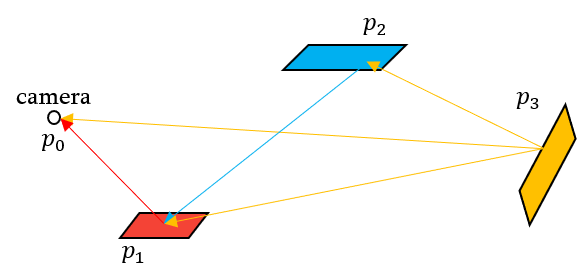

# Monte Carlo Methods for Volumetric Light Transport Simulation

## Abstract

我们首先描述自由程采样的模拟和非模拟程序，并讨论用于计算透射率的各种期望值、碰撞和轨迹长度估计器。
We begin by describing analog and non-analog procedures for free-path sampling and discuss various expected-value, collision, and track-length estimators for computing transmittance.

## Introduction

## Optical Properties

### Collision Coefficients

我们认为介质由一团散射或吸收光子的微粒组成。我们用统计方法来描述它们，微粒每单位体积的总密度为 $\rho[m^3]$ ，横截面积为 $\sigma_s,\sigma_a[m^2]$ ，用于散射和吸收粒子。
We consider a participating medium to consist of a collection of microscopic particles which either scatter or absorb photons. We describe them statistically by specifying their total density per unit volume $\rho[m^3]$ and their cross-section areas, $\sigma_s,\sigma_a[m^2]$ for scattering and absorbing particles.

假设粒子位置在统计上是独立的，我们得到吸收系数 $\mu_a=\rho\sigma_a$ 和散射系数 $\mu_s=\rho\sigma_s$，每个都量化了穿过每单位距离的光子的相应相互作用的局部概率密度 $[m^-1]$ 。
Assuming that particle positions are statistically independent, we yield the absorption coefficient $\mu_a=\rho\sigma_a$ and scattering coefficient $\mu_s=\rho\sigma_s$, each quantifying the local probability density $[m^-1]$ of a photon undergoing the respective interaction per unit distance traveled.

消光系数 $\mu_t=\mu_a+\mu_s$ 表示每单位距离发生任一类型事件的概率密度。 比率 $\alpha=\mu_s/\mu_t$ 量化了在碰撞中经历散射事件的光子的分数，它通常称为单散射反照率。
The extinction coefficient $\mu_t=\mu_a+\mu_s$ indicates the probability density of either type of event happening per unit distance. The ratio $\alpha=\mu_s/\mu_t$ quantifies the fraction of photons that undergo a scattering event at a collision, and it is commonly referred to as the single-scattering albedo.

### Phase Function

在介质中某个点散射的光的方向密度由相位函数 $f_p$ 给出，通常取决于入射和出射方向，具有可选的空间变化。
The directional density of light scattered at a point in a medium is given by the phase function $f_p$ and generally depends on the incident and outgoing directions, with an optional spatial variation.

Isotropic phase function: $f_p=1/(4\pi)$. Others are anisotropic.

### Spatial Dependence

如果所有这些介质属性在空间上都是不变的，则称该介质是均质的。否则，介质是不均匀的。
If all of these medium properties are spatially invariant, the medium is said to be homogeneous. Otherwise, the medium is inhomogeneous or heterogeneous.

### Directional Dependence

当 $\mu_a$ 和 $\mu_s$ 不依赖于光的传播方向，并且相位函数只通过入射光和散射光之间的角度来参数化时，则称该**介质是各向同性**的。
When the collision coefficients $\mu_a$ and $\mu_s$ do not depend on the direction of light propagation and the phase function can be parameterized only by the angle between incident and scattered light, then the medium is said to be isotropic.

### Assumptions

## Mathematical Foundations for Radiative Transport

### Radiative Transfer Equation

沿着方向 $\omega_o$ 穿过点 $\mathbf x$ 处的可微体积的辐射变化，可以由辐射传递方程描述：
The change in radiance traveling along direction $\omega$ through a differential volume element at point $\mathbf x$ is described by the radiative transfer equation:
$$
(\omega_o\cdot\nabla)L_o(\mathbf x,\omega_o)=-\mu_a(\mathbf x)L_o(\mathbf x,\omega_o)-\mu_s(\mathbf x)L_o(\mathbf x,\omega_o)+\mu_s(\mathbf x)L_s(\mathbf x,\omega_o)+\mu_a(\mathbf x)L_e(\mathbf x,\omega_o)
$$
Where:
$$
-\mu_a(\mathbf x)L(\mathbf x,\omega_o)-\mu_s(\mathbf x)L(\mathbf x,\omega_o)
$$
are correspond losses due to absorption and out-scattering.
$$
L_s(\mathbf x,\omega_o)=\int_{\mathcal S^2}f_p(\omega_o,\omega_i)L_i(\mathbf x, \omega_i)d\omega_i
$$
从 $\omega_i$ 入射到 $\mathbf x$ 的辐射 $L_i$，经过相位函数的调制得到出射到 $\omega_o$ 向的辐射 $L_s$。
collects the incident radiance $L_i$ from all the direction $\omega_i$ to the point $\mathbf x$ on the unit sphere $\mathcal S^2$, processed by phase function and produces a outgoing radiance $L_s$ from the point $\mathbf x$ to the direction $\omega_o$.

沿 $\omega_o$ 方向对 RTE 的两侧进行积分：
Integrating both sides of the RTE along the direction $\omega$ yields the integral form:
$$
L(\mathbf x,\omega_o)=\int_{0}^{\infty}T(\mathbf x,\mathbf y)[\mu_a(\mathbf y)L_e(\mathbf y,\omega_o)+\mu_s(\mathbf y)L_s(\mathbf y,\omega_o)]dy
$$
where $\mathbf y=\mathbf x-t\omega_o$.

透射率 $T(x,y)$ 是通过将由于吸收和外散射导致的光损失沿线折叠成单个微分过程并将其沿 $\omega$ 积分得到的，得到
The transmittance $T(x,y)$ is obtained by folding the loss of light along a line due to absorption and out-scattering into a single differential process and integrating it along $\omega$, yielding
$$
T(\mathbf x, \mathbf y)=\exp({-\int_{0}^{t}\mu_t(\mathbf x-s\omega)ds})
$$
where the optical thickness $\tau$ is 
$$
\tau(t)=\int_{0}^{t}\mu_t(\mathbf x-s\omega)ds
$$

### Volume Rendering Equation

Surface rendering equation:
$$
L(\mathbf x,\omega_o)=L_e(\mathbf x,\omega_o)+\int_{\mathcal S^2}f_r(\mathbf x,\omega_o,\omega_i)L_i(\mathbf x,\omega_i)|\langle \mathbf n_{\mathbf x},\omega_i\rangle|d\omega_i
$$
体渲染方程：
For the surface point $\mathbf z = \mathbf x-z\omega$​, the resulting volume rendering equation (VRE):
$$
L_o(\mathbf x,\omega)=\int_{0}^{z}T(\mathbf x,\mathbf y)[\mu_a(\mathbf y)L_e(\mathbf y,\omega_o)+\mu_s(\mathbf y)L_s(\mathbf y,\omega_o)]dy+T(\mathbf x,\mathbf z)L_o(\mathbf z,\omega_o)
$$

### Path Integral Formulation

在路径积分公式中，渲染图像 $I$ 中像素 $j$ 的值可以描述为概念上简单的积分：
In the path integral formulation, the value of pixel $j$ in the rendered image $I$ can be described as a conceptually simple integral:
$$
I_j=\int_{\mathcal P}f_j(\mathcal X)d\mathcal X
$$
$\mathcal X=(\mathbf x_0,\dots,\mathbf x_k)\in\mathcal P$ 是长度为 $k$（段）的传输路径，$\mathcal P$ 是在这个场景中所有这些可能路径的形成的空间。
$\mathcal X=(\mathbf x_0,\dots,\mathbf x_k)\in\mathcal P$ is a transport path of length $k$ (segments) and $\mathcal P$ is the space of all such possible paths in the scene.

Expand the equation:
$$
\begin{align*}
I_j&=L_e(p_1,p_1\to p_0)G(p_0,p_1)T(p_0,p_1)\\
&+\int_{A_1}L_r(p_1,p_2\to p_1)f_r(p_2\to p_1\to p_0)G(p_1,p_2)T(p_1,p_2)dA_1\\
&=L_e(p_1,p_1\to p_0)\\
&+\int_{A_1}L_e(p_2,p_2\to p_1)f_r(p_2\to p_1\to p_0)G(p_1,p_2)T(p_1,p_2)dA_1\\
&+\dots\\
&+\idotsint_{A_1\dots A_n}L_e(p_n,p_{n+1}\to p_n)\prod_{i=1}^{n}[f_r(p_{i+1}\to p_i\to p_{i-1})G(p_i,p_{i+1})T(p_i,p_{i+1})dA_i]\\
\end{align*}
$$

$$
G(\mathbf x,\mathbf y)=\frac{D(\mathbf x,\mathbf y)D(\mathbf y,\mathbf x)}{\|\mathbf x-\mathbf y\|^2}\\
D(\mathbf x,\mathbf y)=\begin{cases}
|\langle \mathbf n_{\mathbf x},\omega_{\mathbf x\to\mathbf y}\rangle|&\mathbf x\text{ on a surface}\\
1&\mathbf x\text{ on a medium}
\end{cases}\\
L_e(\mathbf x,\mathbf y)=\begin{cases}
L_e(\mathbf x,\omega_{\mathbf x\to\mathbf y})&\mathbf x\text{ on a surface}\\
\mu_a(\mathbf x)L_e(\mathbf x,\omega_{\mathbf x\to\mathbf y})&\mathbf x\text{ on a medium}
\end{cases}\\
f_r(p_{i+1}\to p_i\to p_{i-1})=\begin{cases}
f_r(p_{i+1}\to p_i\to p_{i-1})&\mathbf x\text{ on a surface}\\
\mu_s(\mathbf x)f_r(p_{i+1}\to p_i\to p_{i-1})&\mathbf x\text{ on a medium}
\end{cases}\\
$$

这些项中的大多数可能对光的波长具有隐含的依赖，因此可以针对每个波长单独评估测量贡献函数的积分以产生彩色图像。
Most of these terms may have an implicit dependency on the wavelength of light, and the integral over the measurement contribution function may be evaluated for each wavelength separately to yield color images.

### Monte Carlo Integration

$\langle\cdot\rangle$ 表示某个量的 MC 一级估计量。
$\langle\cdot\rangle$ denote an MC estimator of some quantity and write primary estimators for brevity。
$$
\langle L(\mathbf x,\omega)\rangle=\frac{T(\mathbf x,\mathbf y)}{P(y)}[\mu_a(\mathbf y)L_e(\mathbf y,\omega_o)+\mu_s(\mathbf y)L_s(\mathbf y,\omega_o)]dy+\frac{T(\mathbf x,\mathbf z)}{P(z)}L_o(\mathbf z,\omega_o)
$$
$P(y)$ 是采样点 $\mathbf y$ 的 PDF，它与 $\mathbf x$ 相距 $y$ 个单位，并且可以选择用概率 $P(z)$ 评估最近的表面辐射。
$P(y)$ is the PDF of sampling point $\mathbf y$, which is $y$ units away from $\mathbf x$, and where the nearest-surface radiance can be optionally evaluated with probability $P(z)$.

该估计器需要两个主要程序：一个是沿射线采样距离，另一个是评估两个点之间的透射率 $T$。
This estimator requires two main routines: one for sampling distances along the ray, and one for evaluating the transmittance $T$ between two given points.

## Distance Sampling

**自由程采样**：模拟方法沿光线采样到下一次光-介质碰撞的距离，类似于光子与现实世界中的材料作用。
**free-path sampling**: Analog methods sample the distance to the next light-medium collision along the line of flight analogously to how photons interact with materials in the real world.

采样可以是显式的，通过相应的 CDF 的逆；也可以是隐式的，通过概率推理，如在空碰撞算法中。
Sampling can be explicit, via an inversion of the corresponding CDF, or implicit, through probabilistic reasoning as in null-collision algorithms.

### Analytic and Semi-analytic Free-path Sampling

一个明智的重要性采样策略是使用与透射率成正比的距离 PDF。
A sensible importance sampling strategy is to use a distance PDF that is proportional to transmittance.

透射率 $T(t)$ 是在不与介质碰撞的情况下传播超过特定距离 t。
The transmittance $T(t)$ is travel beyond a certain distance t without colliding with the medium.

记 $X$ 为自由程的随机变量：
Denoting $X$ as an random free-path variable, we then get 
$$
P(X>t)=T(t)
$$
Then the CDF of $X$ is 
$$
F(t)=1-T(t)=1-\exp(-\tau(t))
$$
从算法上讲，该过程相当于生成一个随机数 $\xi$ 并找到在射线上的位置，即 $1-T(t)=\xi$。
Algorithmically, the procedure amounts to generate a random number $\xi$ and finding the position along the ray where $1-T(t)=\xi$.

但不管怎么说，PDF 都是：
$$
P(t)=\frac{dF(t)}{dt}=\mu(t)\exp({-\tau(t)})
$$

#### Closed-form Methods

In homogeneous media, $\tau(t)=t\mu_t$.
$$
F(t)=1-\exp(-\mu_tt)
$$
Then we can apply inverse sampling:
$$
t=-\frac{\ln(1-F(t))}{\mu_t}
$$
Then we using uniform random numbers $\xi\in[0,1)$, we can obtain
$$
t(\xi)=-\frac{\ln(1-\xi)}{\mu_t}
$$
with PDF
$$
P(t)=\mu_t\exp(-\mu_tt)
$$
Use *Newton-Raphson method* to find the solution $t(\xi)$ numerically when closed-form inversion is not possible.

以上过程的假设是介质是无限大的。
The above procedure assumes the medium is infinite.

#### Regular Tracking

某些场景可以很好地描述成闭式自由程采样过程存在的“简单”体积的集合。
Certain scenes can be well described as collections of "simple" volumes for which closed-form free-path sampling routines exist.

Advantage: correctness.

Disadvantage: expensive.

#### Ray Marching

人们可以简单地忽略介质的边界并以固定大小的步长沿着光线前进。
One can simply ignore the boundaries of medium and march along the ray with fixed-size steps.

两个步长之间要累积的光学厚度是假设为常数或线性变化的。一旦前进超过所需的光学厚度值，算法将回退并求解最后两个步骤之间的采样位置，且假设常数或线性消光。
The optical thickness is accumulated assuming the extinction is constant or linear between the marching steps. Once the marching exceeds the desired value of optical thickness, the algorithm retracts and solves for the sampled location between the last two steps, again assuming constant or linear extinction.

Advantage: simple.

Disadvantage: 

用分段常数/线性函数近似实际消光会导致距离分布偏离真实的自由程分布。即使随机抖动，偏差仍然存在，并且当介质包含薄特征时可能变得特别令人反感，前进很可能会错过这些特征。
Approximating the actual extinction with a piecewise constant/ linear function causes the distance distribution to deviate from the true, free-path distribution. The bias persists even if the stepping is randomly jittered and can become particularly objectionable when the medium contains thin features, which the stepping is likely to miss.

### Null-collision Methods

Rejection sampling.

Advantage:

它们适用于比常规追踪更广泛的体积类别，并且不会像光线前进对自由程分布有偏。
They are applicable to a wider class of volumes than regular tracking and do not bias the free-path distribution like ray marching.

Disadvantage: 

他们无法量化单个样本的 PDF。
Their inability to quantify the PDF of individual samples.

零碰撞方法的主要思想是引入对光传输没有影响但能够使用（半）解析距离采样过程的**虚构物质**。虚构的物质表现出所谓的零碰撞，在这种碰撞中，光以不变的能量继续向前传播。
The main idea of null-collision methods is to introduce **fictitious matter** that has no impact on the light transport but enables the use of the (semi-) analytic distance sampling routines. The fictitious matter exhibits so-called null collisions upon which light continues traveling forward with unchanged energy.

#### Delta Tracking

Delta 追踪通过人为地增加碰撞率和拒绝一些碰撞来实现正确的自由路径分布。
Delta tracking achieves the correct free-path distribution by artificially increasing the collision rate and rejecting some of the collisions.
$$
-\mu_n(\mathbf x)L(\mathbf x,\omega)+\mu_n(\mathbf x)\int_{\mathcal S^2}\delta(\omega-\omega')L(\mathbf x,\omega')d\omega'=0
$$
由于零碰撞造成的损失和收益完全抵消，而保持辐射场没有损耗。
the losses and gains due to null-collisions perfectly cancel out leaving the radiation field intact.

The equation:
$$
L(\mathbf x,\omega)=\int_{0}^{\infty}T_{\bar{\mu}}(\mathbf x,\mathbf y)[\mu_a(\mathbf y)L_e(\mathbf y,\omega)+\mu_s(\mathbf y)L_s(\mathbf y,\omega)+\mu_n(\mathbf y)L(\mathbf y,\omega)]dy
$$
where
$$
T_{\bar{\mu}}(\mathbf x,\mathbf y)=\exp({-\int_{0}^{y}\mu_a(\mathbf z)+\mu_s(\mathbf z)+\mu_n(\mathbf z)dz})
$$
Turning the equation into a Monte Carlo estimator:
$$
\langle L(\mathbf x,\omega)\rangle=\frac{T_{\bar{\mu}}(\mathbf x,\mathbf y)}{P_{\bar{\mu}}(y)}[\mu_a(\mathbf y)L_e(\mathbf y,\omega)+\mu_s(\mathbf y)L_s(\mathbf y,\omega)+\mu_n(\mathbf y)L(\mathbf y,\omega)]
$$
在采样了一个暂定的 $\mathbf y$ 之后，delta tracking 随机选择其中一个，概率与对应的系数成正比，分别将碰撞分类为吸收、散射或不反应。
After sampled a tentative $\mathbf y$, delta tracking randomly chooses one of them with probabilities proportional to the corresponding coefficient, classifying the collision as either absorptive, scattering, or null, respectively.
$$
P_a(\mathbf y)=\frac{\mu_a(\mathbf y)}{\bar{\mu}(\mathbf y)}\quad P_s(\mathbf y)=\frac{\mu_s(\mathbf y)}{\bar{\mu}(\mathbf y)}\quad P_n(\mathbf y)=\frac{\mu_n(\mathbf y)}{\bar{\mu}(\mathbf y)}
$$
吸收和散射事件代表真实的碰撞并在原始介质中产生有效的自由程样本。另一方面，不反应事件需要通过从 $\mathbf y$ 递归调用估计器来估计 $L$。 因此，Delta 追踪通过对试探性碰撞进行采样，直到在概率上将其分类为真实碰撞为止。采样的自由飞行距离 $y$ 是从射线原点到第一次真正碰撞的距离。
The absorptive and scattering events represent real collisions and yield valid free-path samples in the original medium. The null collision, on the other hand, requires estimating $L$ by recursively invoking the estimator from $\mathbf y$. Delta tracking thus steps forward along the line by sampling tentative collisions until one is probabilistically classified as real. The sampled free-flight distance $y$ is then the one from the ray origin to the first real collision.

**Unknown PDF Value**

组合介质中到第一次实际碰撞的距离分布对应于原始介质中的自由程分布，Delta 追踪产生的自由程样本的 PDF 为 $\mu_t(\mathbf y)T(\mathbf x, \mathbf y)$。
The distribution of distances to the first real collision in the combined medium corresponds to free-path distribution in the original medium, the PDF of free-path samples produced by delta tracking is $\mu_t(\mathbf y)T(\mathbf x,\mathbf y)$.

计算 PDF 的困难源于在任意长的空碰撞链之后，可能会发生真正的碰撞。因此，真实碰撞的（边际）PDF 只能通过对无限的零碰撞链积分来计算，这实际上是不可行的。
The difficulty of calculating the PDF stems from the fact that the real collision can follow after an arbitrarily long chain of null collisions. The (marginal) PDF of the real collision can thus be calculated only by integrating over an infinite set of null-collision chains, which is practically infeasible.

**Stratification and Quasi-random Number**

准蒙特卡罗序列需要从随机数维度到使用它们的采样技术的固定映射。 Delta 追踪需要可变数量的随机数，这样的映射很难推导出来。
Quasi-Monte Carlo sequences requires a fixed mapping from random number dimensions to sampling techniques that use them. Delta tracking require a variable number of random numbers, such a mapping is hard to derive.

采用某种分层的一种策略是将两个分层维度映射到第一次尝试性碰撞的采样。
One strategy to employ some stratification is to map two stratified dimensions to sampling of the first tentative collision.

**Overhead of Null Collisions**

#### Weighted Delta Tracking

为了抵消与模拟过程的偏差，非模拟方法对每个样本进行加权，产生一个加权距离分布，该分布仍然对应于真实自由程的分布。
To counteract the deviation from the analog process, non-analog methods weight each sample producing a weighted distance distribution that still corresponds to the distribution of true free paths.

加权提供了处理具有负消光系数的介质，以及 $\bar\mu(\mathbf x)$ 不是 $\mu_t(\mathbf x)$ 的主要元素的情况的方法，例如对于某些 $\mathbf x,\mu_n(\mathbf x) < 0$ 。
The weighting provides means to handle media with negative extinction coefficients as well as cases where $\bar\mu(\mathbf x)$ is not a majorant of $\mu_t(\mathbf x)$, for example, $\mu_n(\mathbf x) < 0$ for some $\mathbf x$.

重写估计方程：
$$
\langle L(\mathbf x,\omega)\rangle=\frac{T_{\bar{\mu}}(\mathbf x,\mathbf y)}{P_{\bar{\mu}}(y)}\sum_{\mathcal C}\mu_\star(\mathbf y)L_\star(\mathbf y,\omega)
$$
$\mathcal C=\{(\mu_a,L_e),(\mu_s,L_s),(\mu_n,L)\}$.

将单个辐射分量的概率评估形式化 （Russian roulette）：
Formalize the probabilistic evaluation of individual radiance components (Russian roulette):

Denoting:
$$
\langle f(x)\rangle=\mathcal H(P-\xi)\frac{f(x)}{P}\\
\mathcal H(x)=\begin{cases}1&x\ge0\\0&x<0\end{cases}
$$
$\xi$ is a uniform random number, $P$ is the probability of evaluating $f(x)$.

Then the estimator is:
$$
\langle L(\mathbf x,\omega)\rangle=\frac{T_{\bar{\mu}}(\mathbf x,\mathbf y)}{P_{\bar{\mu}}(y)}\sum_{\mathcal C}\mathcal H(P_\star(\mathbf y)-\xi_\star)\frac{\mu_\star(\mathbf y)}{P_\star(\mathbf y)}L_\star(\mathbf y,\omega)
$$
在标准 Delta 追踪中，概率 $P_\star(\mathbf x)$ 与各自的碰撞系数成正比，而且**距离采样 PDF 为 $P_{\bar\mu}(y)=\bar\mu(\mathbf y )T_{\bar\mu}(\mathbf x,\mathbf y)$**，很明显
In standard delta tracking, the probabilities $P_\star(\mathbf x)$ are proportional to the respective collision coefficient and **the distance sampling PDF is $P_{\bar\mu}(y)=\bar\mu(\mathbf y)T_{\bar\mu}(\mathbf x,\mathbf y)$**.
$$
w_\star(\mathbf x)=\frac{T_{\bar{\mu}}(\mathbf x,\mathbf y)}{P_{\bar{\mu}}(y)}\frac{\mu_\star(\mathbf x)}{P_\star(\mathbf x)}=\frac{T_{\bar{\mu}}(\mathbf x,\mathbf y)}{\bar\mu(\mathbf y )T_{\bar\mu}(\mathbf x,\mathbf y)}\frac{\mu_\star(\mathbf x)}{\mu_\star(\mathbf x)/\bar\mu(\mathbf x)}=1
$$
假设在 $(i-1)$ 次空碰撞后在 $\mathbf x_i$ 处发生了一个真正的碰撞 $i$，则由空碰撞引起的权重链为：
Assuming a real collision $i$ occurs at $\mathbf x_i$ after $(i-1)$ null collisions, the weight induced by the chain of null collision is: 
$$
w(\mathbf x_1\dots\mathbf x_{i-1})=\prod_{j=1}^{i-1}\frac{T_{\bar{\mu}}(\mathbf x_{j-1},\mathbf x_{j})}{P_{\bar{\mu}}(x_{j})}\frac{\mu_n(\mathbf x_{j})}{P_n(\mathbf x_{j})}=\prod_{j=1}^{i-1}\frac{\mu_n(\mathbf x_{j})}{\bar{\mu}(\mathbf x_{j})P_n(\mathbf x_{j})}
$$
这为我们提供了一种对真实碰撞进行加权以获得加权分布的方法，该分布等于原始体积中的自由路径的分布。
This provides us with a recipe for weighting real collisions to obtain a weighted distribution that is equivalent to that of free paths in the original volume.

当体积包含一个高消光的小区域时，一个有界 $\bar\mu$ 将导致其他地方的许多空碰撞。 减少 $\bar\mu$ 会以负权重为代价减少空冲突的数量。
When the volume contains a small region with high extinction, a bounding $\bar\mu$ will lead to many null collisions everywhere else. Decreasing $\bar\mu$ reduces the number of null collisions at the cost of negative weights.

负权边可导致方差快速增加。
Negative weights will rapidly increase variance.

无界的 $\bar\mu(\mathbf x)$ 会导致负的 $\mu_n(x)$，可以这样解决：
Non-bounding $\bar\mu(\mathbf x)$ leading to negative $\mu_n(x)$ can be handled
$$
P_a(\mathbf x)=\frac{\mu_a(\mathbf x)}{\mu_t(\mathbf x)+|\mu_n(\mathbf x)|}\\
P_s(\mathbf x)=\frac{\mu_s(\mathbf x)}{\mu_t(\mathbf x)+|\mu_n(\mathbf x)|}\\
P_n(\mathbf x)=\frac{|\mu_n(\mathbf x)|}{\mu_t(\mathbf x)+|\mu_n(\mathbf x)|}\\
$$
如果 $\mu_n(\mathbf x)$ 非负，则和原来的形式一样。

### Decomposition Tracking

（加权）Delta 追踪的性能实际上与查询随空间变化的介质碰撞系数的成本成正比。
The performance of (weighted) delta tracking is in practice proportional to the cost of querying spatially-varying medium collision coefficients.

这个想法是将体积分解为两个分量：一个（分段）均匀分量 $\mu_t^c$，可以轻易地采样，以及一个剩余的不均匀分量 $\mu^r_t(x) =\mu_t(x)- \mu^c_t$，尽量少查询以降低成本。
The idea is to decompose the volume into two components: a (piecewise) homogeneous component $\mu_t^c$, which can be sampled cheaply, and a residual heterogeneous component $\mu^r_t(x) =\mu_t(x)-\mu^c_t$, which should be queried as little as possible to reduce the cost.

给定两个距离样本，$\mathbf x_c$ 表示均匀分量中的自由路径，$\mathbf x_r$ 使用残差分量的 Delta 追踪获得，复合体积中的有效自由路径可以通过两个采样距离最小值来获得，$\mathbf x = \min(\mathbf x_c,\mathbf x_r)$。
Given two distance samples, $\mathbf x_c$ representing a free path inthe homogeneous component, and $\mathbf x_r$ obtained using delta tracking of the residual component, a valid free path in the composite volume can be obtained by taking the minimum of the two sampled distances, $\mathbf x = \min(\mathbf x_c,\mathbf x_r)$.

首先对均匀分量进行采样，然后对不均匀分量进行 Delta 追踪，但是一旦试探性碰撞超过 $\mathbf x_c$，追踪就会终止。
First sample the homogeneous component and then perform delta tracking of the heterogeneous component, but as soon as a tentative collision exceeds $\mathbf x_c$, the tracking is terminated.

### Tabulation-base Sampling

通常沿着射线构建分段多项式 PDF ，使用二分搜索找到采样段，然后求解多项式以找到确切位置。
One typically builds a piecewise-polynomial PDF along the ray and finds the sampled location using a binary search over the segments, followed by solving the polynomial to find the exact location.

## Transmittance Estimation

透射率量化了在两点 $\mathbf x$ 和 $\mathbf y$ 之间，传输但没有经历吸收或向外散射的光子的预期占比。
Transmittance quantifies the expected fraction of photons that travel between two points $\mathbf x$ and $\mathbf y$ without undergoing absorption or out-scattering.

在对自由程进行采样时，我们通过距离分布隐式地考虑了透射率。如果使用其他距离 PDF，或者在计算沿给定光线（例如路径追踪器中的阴影光线）的衰减时，我们需要明确地估计透射率。
When sampling free paths, we account for transmittance implicitly through the distribution of distances. If other distance PDFs are used, or when calculating attenuation along given rays (e.g. shadow rays in a path tracer), we need to estimate transmittance explicitly.

### Estimators Integrating Optical Thickness

#### Expected-value Estimator

期望值估计器：当沿光线的消光系数有解析的光学厚度时，可以准确计算透射率（零方差且无偏差）。
Expected-value estimators: When the extinction coefficient along the ray permits estimating optical thickness analytically, the transmittance can be calculated exactly (with zero variance and no bias).
$$
\langle T(t)\rangle=\exp(-\mu_tt)\quad(\text{for homogeneous media})
$$
Constant, linear, exponential can be done analytically.

#### Regular Tracking

我们沿着从 $0$ 到 $t$ 的直线扫描，找到所有边界交叉点 $t$，对于每个穿透体积 $i$，我们计算重叠光线段的光学厚度 $\tau_i$。
We sweep along the straight line from $0$ to $t$ finding all boundary crossings $t$ and for each penetrated volume $i$, we compute optical thickness $\tau_i$ of the overlapping ray segment.
$$
T(t)=\exp(-\sum_{i}^{k}\tau_i)
$$
由于光学厚度是精确计算的，因此可以将常规追踪归类为期望值估计器。
Since the optical thickness is computed exactly, regular tracking can be classified as an expected-value estimator.

#### Ray Marching and Quadrature Rules

基本思想是通过数值求积来近似光学厚度积分：
The basic idea is to approximate the optical thickness integral by a numerical quadrature:
$$
\langle T(t)\rangle=\exp(-\langle\tau(t)\rangle)
$$
因此，光线前进可以被视为一种有偏差的期望值估计器。
Ray marching can therefore be viewed as a biased expected-value estimator.

#### Monte Carlo Integration of Optical Thickness

$$
\langle\tau(t)\rangle=\frac{1}{k}\sum_{i=1}^{k}\frac{\mu_t(t_i)}{P(t_i)}\quad t_i\in[0,t],t_i\propto P(t_i)
$$

本质是 Riemann 和。

一种分层 MC 方法，对整个均匀间隔样本序列用单个均匀随机偏移 $\xi\in[0,1)$ 抖动。
A stratified MC approach which jitters an entire sequence of regularly spaced samples using a single uniform random offset $\xi\in[0,1)$.
$$
\langle\tau(t)\rangle=\sum_{i=1}^{k}\mu_t(t_i)\Delta_t\quad t_i=(i+\xi)\Delta_t
$$
这使这种方法更接近于 Riemann 和，但随机抖动使得不同评估之间的误差去相关了，并用噪声代替了结构化（带状）伪影。
This brings this approach even closer to the Riemann sum, but the random jitter decorrelates the error between different evaluations and replaces structured (banding) artifacts with noise.

Transmittance estimate is biased, proven using Jensen’s inequality.

### Estimators Using Free-path Sampling

想象一下用一个简单的 MC 估计器来近似它，该估计器抽取一个随机距离 $t_i$。
Imagine approximating it with a simple MC estimator that draws random distances $t_i$.

#### Collision Estimator

碰撞估计器通过将给定距离 $t$ 与该距离处的碰撞密度相关联来近似估计该距离处的透射率。
Collision estimators approximate the transmittance at a given distance $t$ by relating it to the collision density at that distance.

对 $\delta$ 函数进行采样是不可能的，然后我们用有限支持域的归一化内核 $K$ 替换 $\delta$ 分布：
Sampling a $\delta$ function is impossible, then we replace the $\delta$ distribution with some normalized kernel $K$ with finite support:
$$
T(t)\approx\int_{0}^{\infty}T(s)K(s-t)ds\approx\frac{T(t_i)K(t_i-t)}{P(t_i)}
$$
虽然此步骤引入了偏差——对透射率模糊了 $K$ 倍——但右式的单样本 MC 估计器提供了一个可用的结果。
While this step introduces bias--blurring of transmittance by $K$--the one-sample MC estimator on the RHS provides a usable result.

右式仍然需要评估在 $t_i$ 处的透射率。如果我们用 $P(t_i)=\mu_t(t_i)T(t_i)$ 的自由程采样 PDF 对距离 $t_i$ 进行采样：
The RHS still requires evaluating the transmittance at $t_i$. If we sample the distances $t_i$ using free-flight sampling with PDF $P(t_i)=\mu_t(t_i)T(t_i)$:
$$
\langle T(t)\rangle=\frac{T(t_i)K(t_i-t)}{\mu_t(t_i)T(t_i)}=\frac{K(t_i-t)}{\mu_t(t_i)}
$$
一般来说，任何归一化的内核都是可以接受的，随着内核的宽度接近 delta 分布，估计量就会接近正确的期望值。
In general, any normalized kernel is admissible, and as the width of the kernel approaches the delta distribution, the estimator approaches the correct expected value.

### Track-length Estimator

碰撞估计器考虑在特定位置/距离发生的光子碰撞密度来近似透射率，但轨道长度估计器将透射率解释为光子至少到达某个距离的概率。
While collision estimators approximate transmittance by considering the density of photon collisions occurring at a specific location/distance, track-length estimators interpret the transmittance as the probability that a photon will reach at least some distance.
$$
\langle T(t)\rangle=\begin{cases}
\frac{T(t)}{P(\text{accept})}&\text{accepted}\\
0&\text{rejected}\\
\end{cases}
$$
上面的表达式仅在某些时候评估透射率，概率为 $P(\text{accept})$，其余时间仅返回零。
Russian roulette: The above expression evaluates the transmittances only some of the time, with probability $P(\text{accept})$, and the remaining times it just returns zero.
$$
\text{E}[\langle T(t)\rangle]=P(\text{accept})\frac{T(t)}{P(\text{accept})}+0=T(t)
$$
**unbiased**.

诀窍是让 $P(\text{accept})$ 恰好等于透射率 $T(t)$，抵消这两项，我们就返回 $1$ 以避免评估透射率。
The trick is to design the acceptance probability $P(\text{accept})$ so that it exactly equals the transmittance $T(t)$, in which case the terms will cancel out, and we can return $1$ and avoid the need to evaluate transmittance at all.

我们可以通过将接受定义为我们已经生成自由飞行距离 $t_i>t$ 的条件来实现这一点。
We can accomplish this by defining accept as the condition that we have generated a free-flight distance $t_i>t$.

如果自由飞行距离根据透射率分布，$P(t_i)=\mu_t(t_i)T(t_i)$，则光子至少行进至 $t$ 的概率为：
If the free-flight distances are distributed according to the transmittance, $P(t_i)=\mu_t(t_i)T(t_i)$, the probability that a photon has traveled at least as far as $t$ is:
$$
P(t_i>t)=\int_t^\infty P(s)ds=\int_t^\infty \mu_t(s)T(s)ds=T(t)
$$
改编一下：
$$
\langle T(t)\rangle=\begin{cases}
\frac{T(t)}{P(t_i>t)}=1&t_i>t\\
0&t_i\le t\\
\end{cases}
$$

#### Weighted Track-length Estimator

公式：
$$
\langle T(t)\rangle=\begin{cases}
\frac{T(t)}{P(t_i>t)}=1&t_i>t\\
0&t_i\le t\\
\end{cases}
$$
但是采样 PDF 不一定与 $T(t)$ 完全抵消。
But sampling PDF does not necessarily cancel out exactly with $T(t)$.

**Residual Tracking**

残差追踪的目地是解析地处理一部分介质，并且仅对消光函数的剩余部分使用轨道长度估计器
The goal of residual tracking is to account for a portion of the medium analytically, and only use the track-length estimator for the remaining portion of the medium’s extinction function.

将异构消光函数 $\mu_t(t)$ 分解为控制 $\mu_t^c(t)$ 和残差 $\mu_t^r(t)$ 消光函数，使得 $\mu_t(t)=\mu_t ^c(t)+\mu_t^r(t)$，因此 $T(t)=T^c(t)+T^r(t)$。
Decomposing the heterogeneous extinction function $\mu_t(t)$ into a control $\mu_t^c(t)$ and a residual $\mu_t^r(t)$ extinction function, such that $\mu_t(t)=\mu_t^c(t)+\mu_t^r(t)$ and hence $T(t)=T^c(t)T^r(t)$.

残差跟踪估计器采样距离与残差透射函数成正比，即 $p^r(t_i)=\mu_t^r(t_i)T^r(t_i)$，并使用此采样 PDF 计算分母中的概率：
The residual-tracking estimator samples distances proportional to the residual transmittance function, $p^r(t_i)=\mu_t^r(t_i)T^r(t_i)$, and using this sampling PDF to compute the probability in the denominator:
$$
P(t_i>t)=\int_t^\infty p^r(s)ds=T^r(t)
$$
Then:
$$
\langle T(t)\rangle=\langle T^c(t)\rangle\langle T^r(t)\rangle=\underbrace{T^c(t)}_{\text{analytically }}\underbrace{\begin{cases}1&t_i>t\\0&t_i\le t\end{cases}}_{\text{random}}
$$

