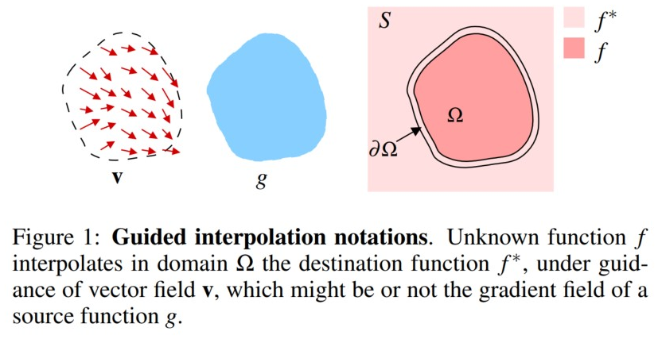

# Poisson Image Editing

## 0 Abstract

第一组工具允许将不透明和透明源图像区域无缝导入目标区域。第二组基于类似的数学思想，允许用户在选定区域内无缝修改图像的外观。
The first set of tools permits the seamless importation of both opaque and transparent source image regions into a destination region. The second set is based on similar mathematical ideas and allows the user to modify the appearance of the image seamlessly, within a selected region.

## 1 Introduction

图像编辑任务涉及全局更改（颜色/强度校正、过滤器、变形）或仅限于选择的局部更改。在这里，我们对于以无缝且轻松的方式实现局部更改有兴趣，特别是手动选择的区域。
Image editing tasks concern either global changes (color/intensity corrections, filters, deformations) or local changes confined to a selection. Here we are interested in achieving local changes, ones that are restricted to a region manually selected, in a seamless and effortless manner.

使用这些经典工具，所选区域的变化会导致可见的接缝，随后，通过沿所选区域的边界羽化，这些接缝只能部分隐藏。
With these classic tools, changes in the selected regions result in visible seams, which can be only partly hidden, subsequently, by feathering along the border of the selected region.

该方法的核心数学工具是具有 Dirichlet 边界条件的 Poisson 偏微分方程，它指定了目标域上未知函数的拉普拉斯算子，以及该域边界上的未知函数值。
The mathematical tool at the heart of the approach is the Poisson partial differential equation with Dirichlet boundary conditions which specifies the Laplacian of an unknown function over the domain of interest, along with the unknown function values over the boundary of the domain. 

动机是双重的。
The motivation is twofold.

1. 首先，心理学家都知道，由拉普拉斯算子抑制的缓慢强度梯度可以叠加在几乎没有明显效果的图像上。相反，拉普拉斯算子提取的二阶变化在感知上是最显着的。
    First, it is well known to psychologists that slow gradients of intensity, which are suppressed by the Laplacian operator, can be superimposed on an image with barely noticeable effect. Conversely, the second-order variations extracted by the Laplacian operator are the most significant perceptually.
2. 其次，有界域上的标量函数由其边界上的值和内部的拉普拉斯算子唯一定义。因此，泊松方程具有唯一解，这导致了一个合理的算法。
    Secondly, a scalar function on a bounded domain is uniquely defined by its values on the boundary and its Laplacian in the interior. The Poisson equation therefore has a unique solution and this leads to a sound algorithm.

因此，给定在某个域上构建未知函数的拉普拉斯算子的方法及其边界条件，泊松方程可以通过数值求解来实现该域的无缝填充。这可以在彩色图像的每个通道中独立重复。
So, given methods for crafting the Laplacian of an unknown function over some domain, and its boundary conditions, the Poisson equation can be solved numerically to achieve seamless filling of that domain. This can be replicated independently in each of the channels of a color image.

求解泊松方程也有另一种解释，即最小化问题：它计算在给定边界条件下，在 L2 范数下梯度最接近某个指定矢量场（引导矢量场）的函数。以这种方式，重建的函数向内插值边界条件，同时尽可能地遵循引导场的空间变化。
Solving the Poisson equation also has an alternative interpretation as a minimization problem: it computes the function whose gradient is the closest, in the L2-norm, to some prescribed vector field — the guidance vector field — under given boundary conditions. In that way, the reconstructed function interpolates the boundary conditions inwards, while following the spatial variations of the guidance field as closely as possible.

由此产生的克隆允许用户无缝地删除和添加对象。通过适当地混合源图像的梯度与目标图像的梯度，也可以令人信服地添加透明对象。此外，可以自动添加具有复杂轮廓（包括孔）的对象，而无需费力切割。
The resulting cloning allows the user to remove and add objects seamlessly. By mixing suitably the gradient of the source image with that of the destination image, it also becomes possible to add transparent objects convincingly. Furthermore, objects with complex outlines including holes can be added automatically without the need for painstaking cutting out.

## 2 Poisson Solution to Guided Interpolation

### Guided Interpolation

$\Omega$ 是 $S$ 的一个封闭子集，边界为 $\partial\Omega$。令 $f^*$ 为定义在 $S$ 上减去 $\Omega$ 内部的已知标量函数，令 $f$ 为定义在 $\Omega$ 内部上的未知标量函数。令 $\mathbf{v}$ 为定义在 $\Omega$ 上的向量场。
Let $S\subset\mathbb{R}^2$, a closed region, be the image definition domain, and let $\Omega$ be a closed subset of $S$ with boundary $\partial\Omega$. Let $f^*$ be a known scalar function defined over $S$ minus the interior of $\Omega$ and let $f$ be an unknown scalar function define over the interior of  $\Omega$. Let $\mathbf{v}$ be a vector field defined over $\Omega$.

$f^∗$ 在 $\Omega$ 上的最简单插值 $f$ 是定义为最小化问题解的膜插值：
The simplest interpolate $f$ of $f^∗$ over $\Omega$ is the membrane interpolate defined as the solution of the minimization problem:
$$
\min_{f}\iint_{\Omega}|\nabla{f}|^2\text{ with }f|_{\partial\Omega}=f^*|_{\partial\Omega}\tag{1}
$$
最小化器必须满足相关的欧拉-拉格朗日方程：
The minimizer must satisfy the associated Euler-Lagrange equation:
$$
\Delta{f}=0\text{ over }\Omega\text{ with }f|_{\partial\Omega}=f^*|_{\partial\Omega}\tag{2}
$$
即满足 Dirichlet 条件的 Laplace 方程。

引导场是在上述最小化问题 $(1)$ 的扩展版本中使用的向量场 $\mathbf{v}$：
A guidance field is a vector field $\mathbf{v}$ used in an extended version of the minimization problem $(1)$ above:
$$
\min_{f}\iint_{\Omega}|\nabla{f}-\mathbf{v}|^2\text{ with }f|_{\partial\Omega}=f^*|_{\partial\Omega}\tag{3}
$$
其解是以下具有 Dirichlet 边界 条件的 Poisson 方程的唯一解：
whose solution is the unique solution of the following Poisson equation with Dirichlet boundary conditions:
$$
\Delta{f}=\nabla\cdot\nabla{f}=\nabla\cdot\mathbf{v}\text{ over }\Omega\text{ with }f|_{\partial\Omega}=f^*|_{\partial\Omega}\tag{4}
$$
本文报告的所有结果都是在 RGB 颜色空间中获得的，但在 CIE-Lab 中也获得了类似的结果。
All the results reported in this paper were obtained in the RGB color space, but similar results were obtained in CIE-Lab for instance.

当引导场 $\mathbf{v}$ 是保守的时，假设 $g$ 是它的势场，它在 $\Omega$ 上定义了修正函数 $\tilde{f}$，使得 $f=g+\tilde{f}$。泊松方程 $(4)$ 然后变成以下具有边界条件的拉普拉斯方程：
When the guidance field $\mathbf{v}$ is conservative, it define the correction function $\tilde{f}$ on $\Omega$ such that $f=g+\tilde{f}$. The Poisson equation $(4)$ then becomes the following Laplace equation with boundary conditions:
$$
\Delta{\tilde{f}}=0\text{ over }\Omega\text{ with }\tilde{f}|_{\partial\Omega}=(f^*-g)|_{\partial\Omega}\tag{5}
$$
因此，在 $\Omega$ 内部，加性校正 $\tilde{f}$ 是沿边界 $\Omega$ 的源和目的地之间的不匹配 $(f^*-g)$ 的膜插值。
Therefore, inside $\Omega$, the additive correction $\tilde{f}$ is a membrane interpolate of the mismatch $(f^*-g)$ between the source and the destination along the boundary $\Omega$.

### Discrete Poisson Solver

|      Symbol      |                         Description                          |
| :--------------: | :----------------------------------------------------------: |
|       $S$        | finite point sets, all the pixels of an image or a subset of them |
|     $\Omega$     |                  an infinite discrete grid                   |
|      $N_p$       | for $p\in S$, the set of $p$'s 4-connected neighbors which are in $S$ |
| $\partial\Omega$ | the boundary, $\partial\Omega=\{p\in S\backslash\Omega\mid N_p\cap\Omega\ne\O\}$ |
|      $f_p$       |                   the value of $f$ at $p$                    |

对于定义在任意形状边界上的狄利克雷边界条件，最好直接离散化变分问题 $(3)$，而不是泊松方程 $(4)$。 $(3)$ 的有限差分离散化产生以下离散的二次优化问题：
For Dirichlet boundary conditions defined on a boundary of arbitrary shape, it is best to discretize the variational problem $(3)$ directly, rather than the Poisson equation $(4)$. The finite difference discretization of $(3)$ yields the following discrete, quadratic optimization problem:
$$
\min_{f|\Omega}\sum_{\langle{p, q}\rangle\cap\Omega\ne\O}(f_p-f_q-v_{pq})^2\\
\forall{p}\in\partial\Omega,f_p=f^*_p;v_{pq}=\mathbf{v}\biggl(\frac{p+q}{2}\biggr)\cdot\overrightarrow{pq}\tag{6}
$$
其解满足以下联立线性方程组：
Its solution satisfies the following simultaneous linear equations:
$$
\forall p\in\Omega,|N|_pf_p-\sum_{q\in{N_p}\cap\Omega}f_q=\sum_{q\in{N_p}\cap\partial\Omega}f_q^*+\sum_{q\in{N_p}}v_{pq}\tag{7}
$$
For inner points:
$$
\forall p\in\Omega\backslash\partial\Omega,|N|_pf_p-\sum_{q\in{N_p}}f_q=\sum_{q\in{N_p}}v_{pq}\tag{7}
$$
Used Gauss-Seidel iteration.

## 3 Seamless Cloning

### Importing Gradients

引导场 $\mathbf{v}$ 的基本选择是直接取自源图像的梯度场。用 $g$ 表示这个源图像，插值是在以下指导下进行的：
The basic choice for the guidance field $\mathbf{v}$ is a gradient field taken directly from a source image. Denoting by $g$ this source image, the interpolation is performed under the guidance of:
$$
\mathbf{v}=\nabla{g}\tag{9}
$$
and
$$
\Delta{f}=\Delta{g}\text{ over }\Omega\text{ with }f|_{\partial\Omega}=f^*|_{\partial\Omega}\tag{10}
$$
discrete:
$$
v_{pq}=g_p-g_q,\forall\langle{p,q}\rangle\tag{11}
$$
在某些情况下，例如纹理转移，在无缝克隆后剩余的源颜色部分可能是不可取的。这可以通过预先将源图像变为单色来解决。
In some cases, such as texture transfer, the part of the source color remaining after seamless cloning might be undesirable. This is fixed by turning the source image monochrome beforehand.

### Mixing Gradients

在某些情况下，需要将 $f^∗$ 的属性与 $g$ 的属性结合起来，例如在纹理或杂乱的背景上添加带有孔或部分透明的对象。
There are situations where it is desirable to combine properties of $f^∗$ with those of $g$, for example to add objects with holes, or partially transparent ones, on top of a textured or cluttered background.

一种可能的方法是将引导场 $\mathbf{v}$ 定义为源和目标梯度场的线性组合，但这具有洗掉纹理的效果。
One possible approach is to define the guidance field $\mathbf{v}$ as a linear combination of source and destination gradient fields but this has the effect of washing out the textures.

Poisson 方法允许使用非保守的指导场，这提供了更引人注目的效果。在 $\Omega$ 的每个点，我们使用以下指导场保留 $f^*$ 或 $g$ 中更强的变化：
The Poisson methodology allows non-conservative guidance fields to be used, which gives scope to more compelling effect. At each point of $\Omega$, we retain the stronger of the variations in $f^*$ or in $g$, using the following guidance field:
$$
\mathbf{v}(\mathbf{x})=\begin{cases}\nabla{f^*}(\mathbf{x})&|\nabla{f^*}|>|\nabla{g}(\mathbf{x})|\\\nabla{g}(\mathbf{x})&|\nabla{f^*}|\le|\nabla{g}(\mathbf{x})|\end{cases}\tag{12}
$$
Discrete:
$$
v_{pq}=\begin{cases}f^*_p-f^*_q&|f^*_p-f^*_q|>|g_p-g_q|\\g_p-g_q&|f^*_p-f^*_q|\le|g_p-g_q|\end{cases}\tag{13}
$$

## 4 Selection Editing

### Texture Flattening

图像梯度 $\nabla{f^*}$ 通过一个只保留最显着特征的稀疏筛子：
The image gradient $\nabla{f^*}$ is passed through a sparse sieve that retains only the most salient features:
$$
\mathbf{v}(\mathbf{x})=\mathbf{M}(\mathbf{x})\nabla{f^*}(\mathbf{x})\tag{14}
$$
A good choice for $\mathbf{M}$ is an edge detector:
$$
v_{pq}=\begin{cases}f_p-f_q&\text{if there is an edge lines between $p$ and $q$}\\0&\text{otherwise}\end{cases}\tag{15}
$$

### Local Illumination Changed

首先，对图像的对数梯度场进行变换，以减少大梯度，增加小梯度。然后使用变换后的向量场 $\mathbf{v}$ 来重建图像的对数 $f$，通过求解泊松方程 $\Delta{f}=\nabla\cdot\mathbf{v}$ 在 Neumann 边界条件下的整个图像域。
First, the gradient field of the logarithm of the image is transformed in order to reduce the large gradients and to increase the small ones. The transformed vector field $\mathbf{v}$ is then used to reconstruct the logarithm of the image, $f$, by solving the Poisson equation $\Delta{f}=\nabla\cdot\mathbf{v}$ over the whole image domain under the Neumann boundary conditions.

使用 Fattal 等人的简化版本转换指导场在对数域中定义为：
Using a simplified version of the Fattal et al. transformation the guidance field is defined in the log-domain by:
$$
\mathbf{v}=\alpha^\beta|\nabla{f}^*|^{-\beta}\nabla{f}^*
$$
with $\alpha=0.2\times\mathrm{mean}(\nabla{f}^*)$, $\beta=0.2$.

### Local Color Changes

给定一个原始彩色图像和一个选择 $\Omega$，这个图像的两个不同颜色的版本可以无缝混合：一个版本在 $\Omega$ 之外提供目标函数 $f^∗$，另一个根据 $(10)$ 提供在 $\Omega$ 内被修改的源函数 $g$。
Given an original color image and a selection $\Omega$, two differently colored versions of this image can be mixed seamlessly: one version provides the destination function $f^∗$ outside $\Omega$, the other one provides the source function $g$ to be modified within $\Omega$ according to $(10)$.

### Seamless Tiling

当域 $\Omega$ 是矩形时，其内容可以通过使用泊松求解器强制执行周期性边界条件来平铺。源图像 $g$ 是原始图像，边界条件是从 $g$ 的边界值推导出来的，使得矩形域的对边对应相同的狄利克雷条件。
When the domain $\Omega$ is rectangular, its content can be made tileable by enforcing periodic boundary conditions with the Poisson solver. The source image $g$ is the original image, and the boundary conditions are derived from the boundary values of $g$, such that opposite sides of the rectangular domain correspond to identical Dirichlet conditions.

